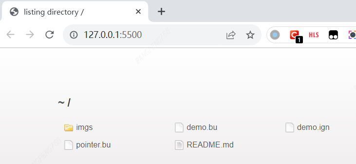

博文地址：https://github.com/wrype/blogs/tree/main/CoreOS%20ignition%20%E5%AE%9E%E9%AA%8C%E8%AE%B0%E5%BD%95%EF%BC%88VirtualBox%EF%BC%89

<!-- TOC -->

- [测试场景：CoreOS 初始化时安装软件](#%E6%B5%8B%E8%AF%95%E5%9C%BA%E6%99%AFcoreos-%E5%88%9D%E5%A7%8B%E5%8C%96%E6%97%B6%E5%AE%89%E8%A3%85%E8%BD%AF%E4%BB%B6)
  - [实验准备](#%E5%AE%9E%E9%AA%8C%E5%87%86%E5%A4%87)
    - [vscode 插件](#vscode-%E6%8F%92%E4%BB%B6)
  - [VirtualBox 导入虚机](#virtualbox-%E5%AF%BC%E5%85%A5%E8%99%9A%E6%9C%BA)
  - [生成 demo.ign，开启 Live Server](#%E7%94%9F%E6%88%90-demoign%E5%BC%80%E5%90%AF-live-server)
  - [准备 butane pointer config](#%E5%87%86%E5%A4%87-butane-pointer-config)
  - [设置 guestproperty，开机](#%E8%AE%BE%E7%BD%AE-guestproperty%E5%BC%80%E6%9C%BA)
    - [开机后查看软件安装](#%E5%BC%80%E6%9C%BA%E5%90%8E%E6%9F%A5%E7%9C%8B%E8%BD%AF%E4%BB%B6%E5%AE%89%E8%A3%85)
- [demo.bu butane 文件解析](#demobu-butane-%E6%96%87%E4%BB%B6%E8%A7%A3%E6%9E%90)
  - [配置密码，上传公钥，启用密码登录](#%E9%85%8D%E7%BD%AE%E5%AF%86%E7%A0%81%E4%B8%8A%E4%BC%A0%E5%85%AC%E9%92%A5%E5%90%AF%E7%94%A8%E5%AF%86%E7%A0%81%E7%99%BB%E5%BD%95)
    - [如何生成 password_hash](#%E5%A6%82%E4%BD%95%E7%94%9F%E6%88%90-password_hash)
  - [设置时区](#%E8%AE%BE%E7%BD%AE%E6%97%B6%E5%8C%BA)
  - [配置正向代理，用于访问 fedora 仓库](#%E9%85%8D%E7%BD%AE%E6%AD%A3%E5%90%91%E4%BB%A3%E7%90%86%E7%94%A8%E4%BA%8E%E8%AE%BF%E9%97%AE-fedora-%E4%BB%93%E5%BA%93)
  - [初始化系统时安装一些包](#%E5%88%9D%E5%A7%8B%E5%8C%96%E7%B3%BB%E7%BB%9F%E6%97%B6%E5%AE%89%E8%A3%85%E4%B8%80%E4%BA%9B%E5%8C%85)
  - [禁用系统自动更新](#%E7%A6%81%E7%94%A8%E7%B3%BB%E7%BB%9F%E8%87%AA%E5%8A%A8%E6%9B%B4%E6%96%B0)
  - [设置主机名](#%E8%AE%BE%E7%BD%AE%E4%B8%BB%E6%9C%BA%E5%90%8D)
- [镜像内嵌 ign 文件](#%E9%95%9C%E5%83%8F%E5%86%85%E5%B5%8C-ign-%E6%96%87%E4%BB%B6)
  - [原理分析](#%E5%8E%9F%E7%90%86%E5%88%86%E6%9E%90)
- [参考](#%E5%8F%82%E8%80%83)

<!-- /TOC -->

# 测试场景：CoreOS 初始化时安装软件

## 实验准备

从 https://builds.coreos.fedoraproject.org/browser?stream=stable&arch=x86_64 下载云镜像，
测试的时候使用的是 [VirtualBox: fedora-coreos-38.20231027.3.2-virtualbox.x86_64.ova](https://builds.coreos.fedoraproject.org/prod/streams/stable/builds/38.20231027.3.2/x86_64/fedora-coreos-38.20231027.3.2-virtualbox.x86_64.ova)

将 VirtualBox 的安装目录加入环境变量，需要用到`VBoxManage`这个命令

下载 [butane](https://github.com/coreos/butane/releases/download/v0.19.0/butane-x86_64-pc-windows-gnu.exe)，放在环境变量包含的目录里面

### vscode 插件

| 插件                  | 用途           |
| --------------------- | -------------- |
| ritwickdey.LiveServer | 本地文件服务器 |

## VirtualBox 导入虚机

|                                                                  |                                                                     |
| ---------------------------------------------------------------- | ------------------------------------------------------------------- |
|                        |                           |
| **修改虚机的名字**<br> | **添加 1 个本地网卡**<br> |

## 生成 demo.ign，开启 Live Server

```bash
butane -s demo.bu -o demo.ign
```

点击 vscode 右下角按钮开启 Live Server

|                                            |                                            |
| ------------------------------------------ | ------------------------------------------ |
|  |  |

[demo.bu](./demo.bu)

```yaml
variant: fcos
version: 1.4.0
passwd:
  users:
    - name: core
      ssh_authorized_keys:
        - <公钥>
      password_hash: <密码>
storage:
  files:
    - path: /etc/ssh/sshd_config.d/20-enable-passwords.conf
      mode: 0644
      contents:
        inline: |
          # Fedora CoreOS disables SSH password login by default.
          # Enable it.
          # This file must sort before 40-disable-passwords.conf.
          PasswordAuthentication yes
    - path: /etc/systemd/system/rpm-ostree-install.service.d/rpms.conf
      mode: 0644
      contents:
        inline: |
          [Service]
          Environment=RPMS="tcpdump iotop telnet"
    - path: /etc/zincati/config.d/90-disable-auto-updates.toml
      mode: 0644
      contents:
        inline: |
          [updates]
          enabled = false
    - path: /etc/hostname
      mode: 0644
      contents:
        inline: core-tester
  links:
    - path: "/etc/localtime"
      target: "../usr/share/zoneinfo/Asia/Shanghai"
systemd:
  units:
    - name: rpm-ostreed.service
      dropins:
        - name: proxy.conf
          contents: |
            [Service]
            Environment="HTTP_PROXY=http://192.168.126.1:20801"
            Environment="HTTPS_PROXY=http://192.168.126.1:20801"
    - name: rpm-ostree-install.service
      enabled: true
      contents: |
        [Unit]
        Description=Layer additional rpms
        Wants=network-online.target
        After=network-online.target
        # We run before `zincati.service` to avoid conflicting rpm-ostree transactions.
        Before=zincati.service
        ConditionPathExists=!/var/lib/%N.stamp
        [Service]
        Type=oneshot
        RemainAfterExit=yes
        ExecStart=/usr/bin/rpm-ostree install --apply-live --allow-inactive $RPMS
        ExecStart=/bin/touch /var/lib/%N.stamp
        [Install]
        WantedBy=multi-user.target
```

## 准备 butane pointer config

这个场景下需要为虚机设置`guestproperty`，填入 ignition。
由于 Windows 下命令行长度不能超过 8KB，这里我们准备一个 pointer config，里面再指向真正的 ignition。


[pointer.bu](./pointer.bu)

```yaml
variant: fcos
version: 1.4.0
ignition:
  config:
    replace:
      source: http://192.168.126.1:5500/demo.ign
```

这里的`192.168.126.1`是网卡 2（本地网卡的网关），端口 5500 是 vscode 插件`Live Server`的默认端口。

生成 ign 文件

```bash
butane -s pointer.bu
{"ignition":{"config":{"replace":{"source":"http://192.168.126.1:5500/demo.ign"}},"version":"3.3.0"}}
```

## 设置 guestproperty，开机

```bash
# VBoxManage guestproperty set <虚机名称> /Ignition/Config <ign文件内容>
VBoxManage guestproperty set apply-cluster /Ignition/Config '{"ignition":{"config":{"replace":{"source":"http://192.168.126.1:5500/demo.ign"}},"version":"3.3.0"}}'
# 枚举 guestproperty
# VBoxManage guestproperty enumerate apply-cluster
```


可以看到，VirtualBox 将 json 写入 xml 存在问题，少了双引号。
这里我们手动修改 xml，修改时需要先移除虚机。


修改保存后，双击 `vbox` 文件重新导入虚机，现在可以做个快照。


### 开机后查看软件安装


# [demo.bu](./demo.bu) butane 文件解析

## 配置密码，上传公钥，启用密码登录

```yaml
passwd:
  users:
    - name: core
      ssh_authorized_keys:
        - <公钥>
      password_hash: <密码>
storage:
  files:
    - path: /etc/ssh/sshd_config.d/20-enable-passwords.conf
      mode: 0644
      contents:
        inline: |
          # Fedora CoreOS disables SSH password login by default.
          # Enable it.
          # This file must sort before 40-disable-passwords.conf.
          PasswordAuthentication yes
```

### 如何生成 password_hash

```bash
docker run -it --rm quay.io/coreos/mkpasswd --method=yescrypt
```

## 设置时区

```yaml
storage:
  links:
    - path: "/etc/localtime"
      target: "../usr/share/zoneinfo/Asia/Shanghai"
```

## 配置正向代理，用于访问 fedora 仓库

```yaml
systemd:
  units:
    - name: rpm-ostreed.service
      dropins:
        - name: proxy.conf
          contents: |
            [Service]
            Environment="HTTP_PROXY=http://192.168.126.1:20801"
            Environment="HTTPS_PROXY=http://192.168.126.1:20801"
```

## 初始化系统时安装一些包

```yaml
storage:
  files:
    - path: /etc/systemd/system/rpm-ostree-install.service.d/rpms.conf
      mode: 0644
      contents:
        inline: |
          [Service]
          Environment=RPMS="tcpdump iotop telnet"
systemd:
  units:
    - name: rpm-ostree-install.service
      enabled: true
      contents: |
        [Unit]
        Description=Layer additional rpms
        Wants=network-online.target
        After=network-online.target
        # We run before `zincati.service` to avoid conflicting rpm-ostree transactions.
        Before=zincati.service
        ConditionPathExists=!/var/lib/%N.stamp
        [Service]
        Type=oneshot
        RemainAfterExit=yes
        ExecStart=/usr/bin/rpm-ostree install --apply-live --allow-inactive $RPMS
        ExecStart=/bin/touch /var/lib/%N.stamp
        [Install]
        WantedBy=multi-user.target
```

## 禁用系统自动更新

```yaml
storage:
  files:
    - path: /etc/zincati/config.d/90-disable-auto-updates.toml
      mode: 0644
      contents:
        inline: |
          [updates]
          enabled = false
```

## 设置主机名

```yaml
storage:
  files:
    - path: /etc/hostname
      mode: 0644
      contents:
        inline: core-tester
```

# 镜像内嵌 ign 文件

> 参考 https://www.matthiaspreu.com/posts/fedora-coreos-embed-ignition-config/

```bash
# 工具安装
sudo apt-get install qemu-utils libguestfs-tools virt-manager
# 查找 boot 分区，fedora-coreos-embed-ign.qcow2 是复制的云镜像
sudo virt-filesystems -a fedora-coreos-embed-ign.qcow2 -l | grep boot
```


准备 1 个 ign 文件并命名为 `config.ign`

```bash
# 进入交互式界面
sudo guestfish -a fedora-coreos-embed-ign.qcow2
```


使用 `sudo virt-manager` 创建虚机测试一下


## 原理分析

CoreOS 上查看脚本 `cat /usr/lib/dracut/modules.d/35coreos-ignition/coreos-ignition-setup-user.sh`，
会把 `/boot/ignition/config.ign` 复制到 `/usr/lib/ignition/user.ign`

> 源码 https://github.com/coreos/fedora-coreos-config/blob/testing-devel/overlay.d/05core/usr/lib/dracut/modules.d/35coreos-ignition/coreos-ignition-setup-user.sh


> journalctl --identifier=ignition --all
> 

# 参考

- VirtualBox 配置指引：https://docs.fedoraproject.org/en-US/fedora-coreos/provisioning-virtualbox/
- zincati 自动更新说明：https://github.com/coreos/zincati/blob/main/docs/usage/auto-updates.md
- 初始化系统时安装软件：https://github.com/coreos/fedora-coreos-tracker/issues/681
- butane 例子：https://coreos.github.io/butane/examples/
