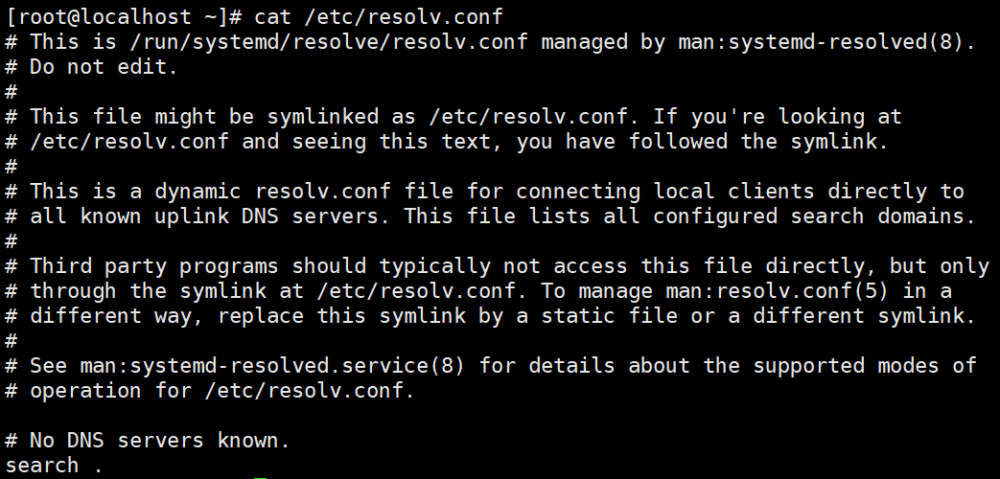

博文地址：https://github.com/wrype/blogs/tree/main/CoreOS%20%E8%B8%A9%E5%9D%91%E7%AC%94%E8%AE%B0

# 网络管理

CoreOS 上没有 networkd 服务，需要通过 NetworkManager 来管理网络，相关的网络配置通过 nmcli 命令来操作。

一般的配置过程是 `nmcli conn show` 查看现有的配置，`nmcli conn edit xxx` 修改配置，
进入交互式界面后 `p` 打印出所有的配置项，`set xxx xxx` 修改配置项，`save` 后 `q` 退出。

网卡的网络配置保存在 `/etc/NetworkManager/system-connections` 目录下。

# /etc/resolv.conf 相关问题

## systemd-resolved

点火文件里面如果没有创建 `/etc/resolv.conf`，resolve.conf 可能会被 systemd-resolved 接管，见下图：


此时我们无法收到手动修改 `/etc/resolv.conf`，重启机器后会被 systemd-resolved 重写。
需要修改 `/etc/systemd/resolved.conf` 才能使配置生效。

上图中 systemd-resolved 启用了本地监听，这个在 k8s CoreDNS 中会产生环路的问题，这里我们禁用掉本地监听。（参考 https://bgbiao.top/post/coredns-loop/）

> 也可以通过修改 `kubelet` 的 `--resolv-conf` 参数解决，参考 https://kubernetes.io/zh-cn/docs/tasks/administer-cluster/dns-debugging-resolution/#known-issues

```bash
# 参考 https://github.com/coreos/fedora-coreos-tracker/issues/1047
mkdir -p /etc/systemd/resolved.conf.d
tee /etc/systemd/resolved.conf.d/fedora-coreos-stub-listener.conf <<'EOF'
[Resolve]
DNSStubListener=no
EOF
systemctl restart systemd-resolved
```



接下来我们配置一下 DNS 服务器。

vi /etc/systemd/resolved.conf


systemctl restart systemd-resolved


## NetworkManager

点火文件里面创建了 `/etc/resolv.conf`，如果 dhcp 中带有 dns 信息，NetworkManager 会接管 `/etc/resolv.conf`，见下图：


此时我们无法收到手动修改 `/etc/resolv.conf`，重启机器后会被 NetworkManager 重写。

如果要手动修改 `/etc/resolv.conf`，可以禁止 NetworkManager 接管 `/etc/resolv.conf`：

```bash
tee /etc/NetworkManager/conf.d/90-disable-dns-manage.conf <<'EOF'
[main]
dns=none
EOF
systemctl restart NetworkManager
```

# 安装本地 rpm 包

```bash
rpm-ostree install -C xxx.rpm
```


安装后重启即可，rpm 包可以在 CoreOS 上安装 `rpm-ostree install --apply-live yum-utils` 后使用 `yumdownloader --resolve xxx` 下载。

已安装的包可以通过 `rpm-ostree override remove xxx` 卸载。

# 硬盘扩容，growfs

CoreOS 只在系统初始化时做一次系统盘扩容，后续如果硬盘扩容了，需要自己手动做系统盘扩容。

硬盘扩容后，可以看到系统盘没有自动扩容：


```bash
# 系统盘扩容
growpart /dev/sda 4
```


```bash
# 文件系统扩容，参考 /usr/lib/systemd/system/systemd-growfs-root.service
/usr/lib/systemd/systemd-growfs /
```


