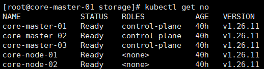
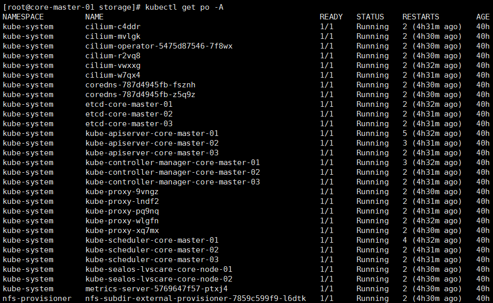

博文地址：https://github.com/wrype/blogs/tree/main/CoreOS%2BSealos%E9%83%A8%E7%BD%B2k8s%E9%9B%86%E7%BE%A4

<!-- TOC -->

- [前期准备](#前期准备)
  - [CoreOS 机器准备](#coreos-机器准备)
    - [将 selinux 设置为 permissive 模式](#将-selinux-设置为-permissive-模式)
    - [**集群机器卸载 docker**](#集群机器卸载-docker)
    - [（可选）卸载云镜像自带的 containerd、runc](#可选卸载云镜像自带的-containerdrunc)
    - [**集群每台机器设置唯一的主机名**](#集群每台机器设置唯一的主机名)
    - [运行 sealos 的机器上做集群机器免密](#运行-sealos-的机器上做集群机器免密)
    - [上传`helm`、`sealos`二进制文件](#上传helmsealos二进制文件)
  - [镜像修改](#镜像修改)
    - [修改 sealos cilium 镜像](#修改-sealos-cilium-镜像)
  - [基础镜像列表](#基础镜像列表)
- [生成 Clusterfile](#生成-clusterfile)
  - [生成 Clusterfile 模板](#生成-clusterfile-模板)
  - [根据模板编写 Clusterfile](#根据模板编写-clusterfile)
- [k8s 集群部署](#k8s-集群部署)
- [Clusterfile 讲解](#clusterfile-讲解)
  - [镜像顺序](#镜像顺序)
  - [设置 TLS 证书主题别名](#设置-tls-证书主题别名)
  - [设置 CIDR](#设置-cidr)
  - [`/usr` 只读挂载处理](#usr-只读挂载处理)
  - [修改 chart values 文件](#修改-chart-values-文件)
  - [查看集群状态](#查看集群状态)
- [参考文档](#参考文档)
- [sealos 常用命令](#sealos-常用命令)
  - [sealos images](#sealos-images)
  - [sealos build --debug -t \<tag\> \<Kubefile\>](#sealos-build---debug--t-tag-kubefile)
  - [sealos pull \](#sealos-pull-img)
  - [sealos save -o \<tar\> -m --format docker-archive \<imgs\>](#sealos-save--o-tar--m---format-docker-archive-imgs)
  - [sealos load -i \<tar\>](#sealos-load--i-tar)
  - [sealos rmi \<imgs\>](#sealos-rmi-imgs)
  - [sealos add](#sealos-add)
  - [sealos delete](#sealos-delete)
  - [sealos reset](#sealos-reset)

<!-- /TOC -->

# 前期准备

## CoreOS 机器准备

### 将 selinux 设置为 permissive 模式

selinux disable 后将装不了 rpm 包

### **集群机器卸载 docker**

CoreOS 的云镜像自带 docker，需要把他卸载掉，运行命令：`rpm-ostree override remove moby-engine`，重启机器

### （可选）卸载云镜像自带的 containerd、runc

运行命令：`rpm-ostree override remove containerd runc`，重启机器

### **集群每台机器设置唯一的主机名**

### 运行 sealos 的机器上做集群机器免密

### 上传`helm`、`sealos`二进制文件

将二进制文件解压放到 master-01 的 `/usr/local/bin` 下面，手动添加 completion：

```bash
cat <<EOF >> ~/.bash_profile
source <(sealos completion bash)
source <(sealctl completion bash)
source <(lvscare completion bash)
source <(helm completion bash)
EOF
```

## 镜像修改

针对 CoreOS 需要对 cilium 镜像做一些修改，修改后把所有镜像都导出到 tar 包：

```bash
sealos save -o k8s1.26.tar -m --format docker-archive labring/kubernetes:v1.26.12 labring/cilium:v1.13.4-coreos labring/metrics-server:v0.6.4 labring/nfs-subdir-external-provisioner:v4.0.18
```

### 修改 sealos cilium 镜像

```bash
sealos pull registry.cn-shanghai.aliyuncs.com/labring/cilium:v1.13.4
```

sealos cilium 镜像的 Dockerfile CMD 里面把二进制文件复制到 `/usr/bin/` 下面，这里重新打包镜像，把 `/usr/bin/` 替换为 `/usr/local/bin/`。

> 源码仓库 https://github.com/labring-actions/cluster-image/tree/main/applications

```bash
sealos build --debug -t labring/cilium:v1.13.4-coreos custom-cilium/
```

## 基础镜像列表

- labring/kubernetes:v1.26.12
- labring/cilium:v1.13.4
- labring/metrics-server:v0.6.4
- labring/nfs-subdir-external-provisioner:v4.0.18

这里我们可以下载阿里云上的 sealos 镜像，加上仓库地址：`registry.cn-shanghai.aliyuncs.com`

# 生成 Clusterfile

## 生成 [Clusterfile 模板](./Clusterfile-template)

> 参考 https://sealos.io/zh-Hans/docs/self-hosting/lifecycle-management/advanced-guide/dual-stack-cluster
> 会连上机器做一些检查

默认的二进制文件路径 `/usr/bin/` 在 CoreOS 上是只读的，指定 `-e BIN_DIR=/usr/local/bin` 参数进行修改。

```bash
sealos gen labring/kubernetes:v1.26.12 labring/cilium:v1.13.4-coreos labring/metrics-server:v0.6.4 labring/nfs-subdir-external-provisioner:v4.0.18 --masters 192.168.3.10,192.168.3.11,192.168.3.12 --nodes 192.168.3.13,192.168.3.14 -e BIN_DIR=/usr/local/bin -o Clusterfile-template
```

## 根据模板编写 [Clusterfile](./Clusterfile)

修改成支持 IPv6 双栈

```yaml
apiVersion: apps.sealos.io/v1beta1
kind: Cluster
metadata:
  name: default
spec:
  env:
    - BIN_DIR=/usr/local/bin
  hosts:
    - ips:
        - 192.168.3.10
        - 192.168.3.11
        - 192.168.3.12
      roles:
        - master
        - amd64
    - ips:
        - 192.168.3.13
        - 192.168.3.14
      roles:
        - node
        - amd64
  image:
    - labring/kubernetes:v1.26.12
    - labring/cilium:v1.13.4-coreos
    - labring/metrics-server:v0.6.4
    - labring/nfs-subdir-external-provisioner:v4.0.18
status: {}
---
apiVersion: kubeadm.k8s.io/v1beta3
kind: ClusterConfiguration
APIServer:
  CertSANs:
    - 127.0.0.1
    - apiserver.cluster.local
    - 10.103.97.2
    - 192.168.3.10
    - 192.168.3.11
    - 192.168.3.12
    # 添加3台master的Ipv6地址
    - fd62:b9ce:de98:2000:bb8d:d642:c349:3370
    - fe80::f8c1:e25d:43e5:99b5
    - fd62:b9ce:de98:2000:f642:2f95:5fdd:1506
    - fe80::3c73:9933:4a64:ea91
    - fd62:b9ce:de98:2000:abf3:44ef:62b4:1b35
    - fe80::2817:ccf7:bbc1:b5ff
Networking:
  # subnet网段必须比node网段大
  PodSubnet: 100.20.0.0/16,fc00:2222::/112
  ServiceSubnet: 100.68.0.0/16,fd00:1111::/112
ControllerManager:
  ExtraArgs:
    flex-volume-plugin-dir: "/opt/libexec/kubernetes/kubelet-plugins/volume/exec/"
    node-cidr-mask-size-ipv6: 120 #Default to 64
    node-cidr-mask-size-ipv4: 24 #Default to 24
---
apiVersion: kubeproxy.config.k8s.io/v1alpha1
kind: KubeProxyConfiguration
clusterCIDR: 100.20.0.0/16,fc00:2222::/112 #add pod IPv6 subnet
---
apiVersion: kubeadm.k8s.io/v1beta3
kind: InitConfiguration
nodeRegistration:
  kubeletExtraArgs:
    volume-plugin-dir: "/opt/libexec/kubernetes/kubelet-plugins/volume/exec/"
---
apiVersion: apps.sealos.io/v1beta1
kind: Config
metadata:
  name: cilium
spec:
  path: charts/cilium/values.yaml
  strategy: merge
  data: |
    ipv6:
      enabled: true
    ipam:
      operator:
        clusterPoolIPv4PodCIDR: "100.20.0.0/16"
        clusterPoolIPv4MaskSize: 24
        clusterPoolIPv6PodCIDR: "fc00:2222::/112"
        clusterPoolIPv6MaskSize: 120
---
apiVersion: apps.sealos.io/v1beta1
kind: Config
metadata:
  name: nfs-subdir-external-provisioner
spec:
  path: charts/nfs-subdir-external-provisioner/values.yaml
  strategy: merge
  data: |
    nfs:
      server: 192.168.3.15
      path: /data/nfs
    storageClass:
      name: managed-nfs-storage
```

# k8s 集群部署

```bash
# 导入镜像
sealos load -i k8s1.26.tar
# 部署集群，相关的临时文件在 ~/.sealos 下面
sealos apply -f Clusterfile
```

# [Clusterfile](./Clusterfile) 讲解

## 镜像顺序

```yaml
image:
  - labring/kubernetes:v1.26.12
  - labring/cilium:v1.13.4-coreos
  - labring/metrics-server:v0.6.4
  - labring/nfs-subdir-external-provisioner:v4.0.18
```

sealos 会按顺序调用镜像中的部署脚本，所以头 2 个镜像的顺序不能调换（先部署 k8s 集群，然后部署网络插件）。

## 设置 TLS 证书主题别名

```yaml
apiVersion: kubeadm.k8s.io/v1beta3
kind: ClusterConfiguration
APIServer:
  CertSANs:
......
```

## 设置 CIDR

```yaml
apiVersion: kubeadm.k8s.io/v1beta3
kind: ClusterConfiguration
Networking:
  # subnet网段必须比node网段大
  PodSubnet: 100.20.0.0/16,fc00:2222::/112
  ServiceSubnet: 100.68.0.0/16,fd00:1111::/112
ControllerManager:
  ExtraArgs:
    # 设置主机地址段掩码长度
    node-cidr-mask-size-ipv6: 120 #Default to 64
    node-cidr-mask-size-ipv4: 24 #Default to 24
```

参考 https://kubernetes.io/zh-cn/docs/setup/production-environment/tools/kubeadm/dual-stack-support/#create-a-dual-stack-cluster

## `/usr` 只读挂载处理

```yaml
......
    volume-plugin-dir: "/opt/libexec/kubernetes/kubelet-plugins/volume/exec/"
......
    flex-volume-plugin-dir: "/opt/libexec/kubernetes/kubelet-plugins/volume/exec/"
......
```

kubeadm 默认参数是在 `/usr/libexec` 下面，`/usr/libexec` 在 CoreOS 上是只读的，这里改为 `/opt/libexec`。

> 参考 https://kubernetes.io/zh-cn/docs/setup/production-environment/tools/kubeadm/troubleshooting-kubeadm/#usr-mounted-read-only

## 修改 chart values 文件

sealos 集群镜像目前已经适配了很多应用，包括 metrics-server、nfs……这里通过修改 chart values.yaml 来做一些配置。

> 仓库地址 https://github.com/labring-actions/cluster-image

```yaml
apiVersion: apps.sealos.io/v1beta1
kind: Config
metadata:
  name: nfs-subdir-external-provisioner
spec:
  path: charts/nfs-subdir-external-provisioner/values.yaml
  strategy: merge
  data: |
    nfs:
      server: 192.168.3.15
      path: /data/nfs
    storageClass:
      name: managed-nfs-storage
```

## 查看集群状态





# 参考文档

- sealos k8s 相关文档：https://sealos.io/zh-Hans/docs/self-hosting/lifecycle-management/
- sealos rootfs：https://github.com/labring-actions/runtime
- sealos 集群镜像：https://github.com/labring-actions/cluster-image

# sealos 常用命令

## sealos images

打印本地镜像缓存，sealos 的本地镜像缓存在 `/var/lib/containers/storage`

## sealos build --debug -t \<tag\> \<Kubefile\>

修改 sealos 镜像

## sealos pull \

下载 sealos 镜像到本地缓存

## sealos save -o \<tar\> -m --format docker-archive \<imgs\>

导出镜像到 tar 包

## sealos load -i \<tar\>

导入镜像

## sealos rmi \<imgs\>

删除镜像

## sealos add

添加 k8s 节点

## sealos delete

删除 k8s 节点

## sealos reset

销毁集群
