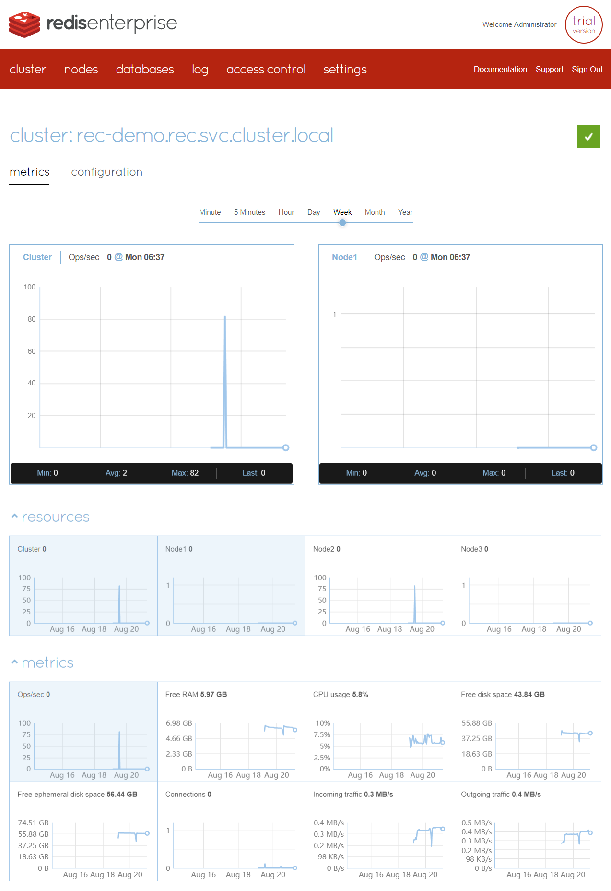
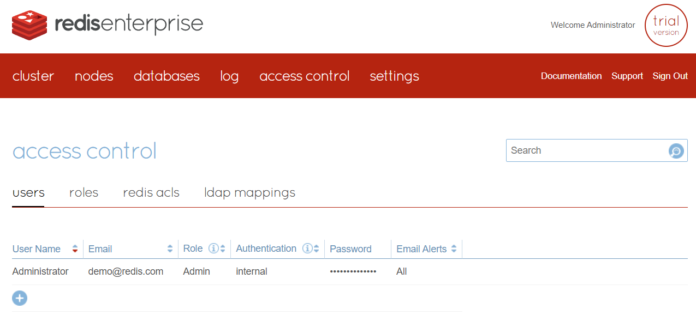

本文旨在介绍 Redis 官方 `Redis Enterprise for Kubernetes` 方案的产品特性，可以为云平台 Redis PaaS 产品设计、竞品分析提供参考

Redis 官方有提供 `Redis Enterprise for Kubernetes` 的私有化部署文档，可以部署在 K8s、Rancher、OpenShift 等平台上

> 版本兼容详见 https://docs.redis.com/latest/kubernetes/reference/supported_k8s_distributions/

私有化部署使用的是**试用版**，存在部分功能限制，需要联系 Redis 官方购买授权，**请勿直接将试用版用在生产环境**

<!-- TOC -->

- [文档链接](#文档链接)
- [产品介绍](#产品介绍)
  - [管理页面](#管理页面)
- [Reference](#reference)

<!-- /TOC -->

## 文档链接

- [产品介绍](./README.md#产品介绍)
- [架构介绍](./arch.md)
- [私有化部署](./deploy.md#私有化部署)
  - [one-to-one 部署架构](./deploy.md#one-to-one-部署架构)
  - [one-to-many 部署架构](./deploy.md#one-to-many-部署架构)
  - [many-to-many 部署架构](./deploy.md#many-to-many-部署架构)
  - [测试代码](./deploy.md#测试代码)
- [Prometheus 监控接入](./deploy.md#prometheus-监控接入)
- [REC 恢复](./problems.md#rec-恢复)
- [问题记录](./problems.md#问题记录)

## 产品介绍

`Redis Enterprise for Kubernetes` 是 Redis 官方针对 K8s 环境提供的 Redis Enterprise 托管解决方案。它允许您在 K8s 集群上轻松部署、管理和运行 Redis 数据库，提供高度可扩展性、高性能和高可用性的 Redis 数据存储。

以下是 `Redis Enterprise for Kubernetes` 的一些主要特点和功能：

1. 无缝集成： `Redis Enterprise for Kubernetes` 可以与现有的 K8s 环境集成，让您能够在容器化的环境中部署 Redis 数据库实例，无需显著修改现有的基础架构。

2. 自动化运维： 该解决方案提供自动化的管理和运维功能，包括自动扩展、故障恢复和备份等。这可以大大减少运维工作量，同时保证数据库的高可用性和稳定性。

3. 多模型支持： 除了传统的键值存储之外，`Redis Enterprise for Kubernetes` 还支持多种数据模型，如图形数据库、文本搜索和时序数据存储，使其适用于各种应用场景。

4. 分布式架构： 该解决方案可以将 Redis 数据库实例在整个 Kubernetes 集群中分布，实现数据的分区和复制，从而提供更好的性能和可伸缩性。

5. **多租户支持**： `Redis Enterprise for Kubernetes` 支持多租户架构，使不同的团队或应用可以在同一个集群上单独管理和使用自己的 Redis 实例，保障资源隔离。

6. 安全性： 通过认证、授权、加密等安全措施，确保 Redis 数据库的安全性。此外，它还提供了审计和监控功能，帮助您追踪数据库的活动并识别潜在问题。

7. 弹性扩展： `Redis Enterprise for Kubernetes` 可以根据负载情况自动进行扩展和缩减，以适应变化的工作负载需求，从而实现更好的资源利用和性能表现。

8. **可视化管理**： 该解决方案提供直观的用户界面，让管理员能够轻松监控和管理 Redis 数据库实例，进行配置、监控和故障排除。

总之，`Redis Enterprise for Kubernetes` 是一个为 K8s 环境量身定制的 Redis 托管解决方案，为开发人员和运维人员提供了在容器化环境中管理和运行 Redis 数据库的便利性和强大功能。它将 Redis 的高性能、可扩展性和多样化的数据模型与 K8s 的灵活性和自动化特性相结合，为企业提供了强大的数据存储解决方案。

### 管理页面

- 管理页面提供基础信息监控，无需接入 Prometheus

  

- 创建 Redis 数据库，支持配置分片集群、多副本、自定义持久化策略、ACL、TLS、周期备份、自定义告警规则（支持邮件告警）

  .png>)

- 审计日志

  .png>)

- RBAC 多租户管理、LDAP 接入

  

## Reference

[Redis Enterprise for Kubernetes 官方文档](https://docs.redis.com/latest/kubernetes/)

HowTos & Tutorials: https://developer.redis.com/howtos/

阿里云自研 [Tair（Redis 企业版）简介](https://help.aliyun.com/zh/redis/product-overview/overview-1)
