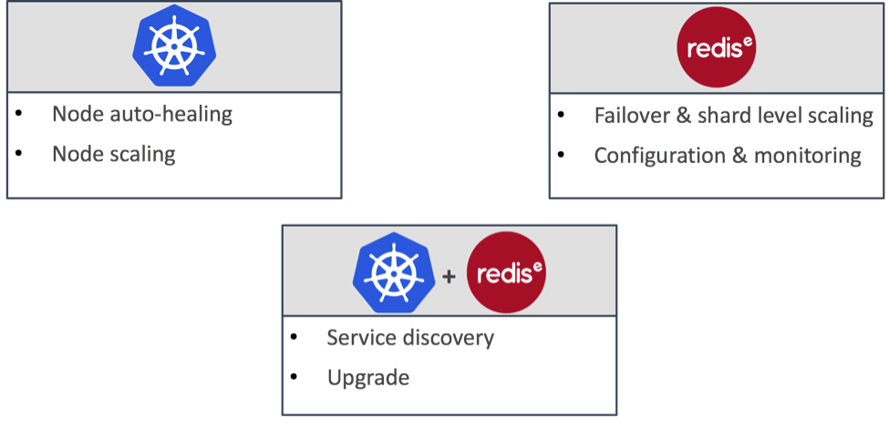
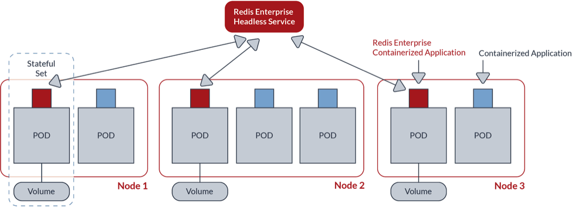
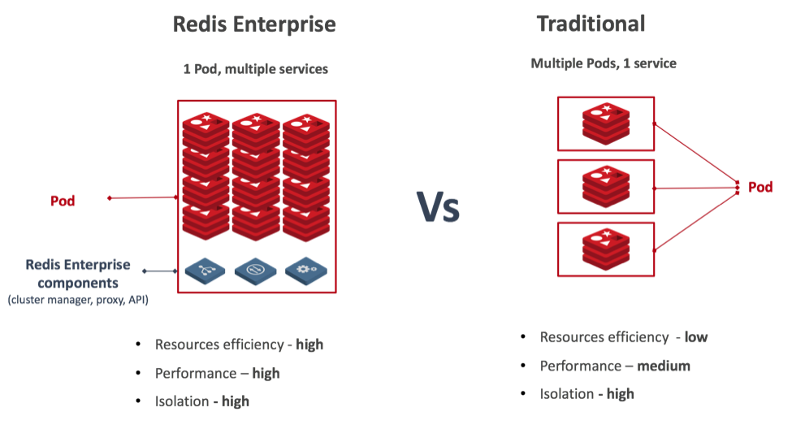
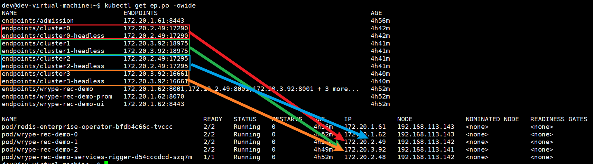
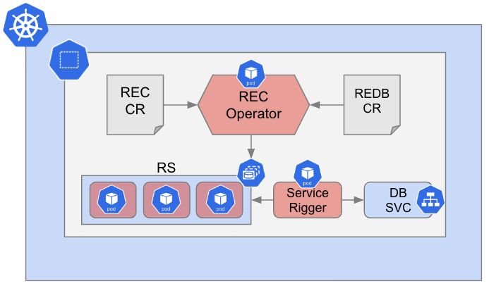
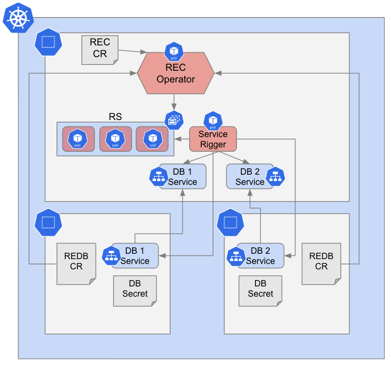
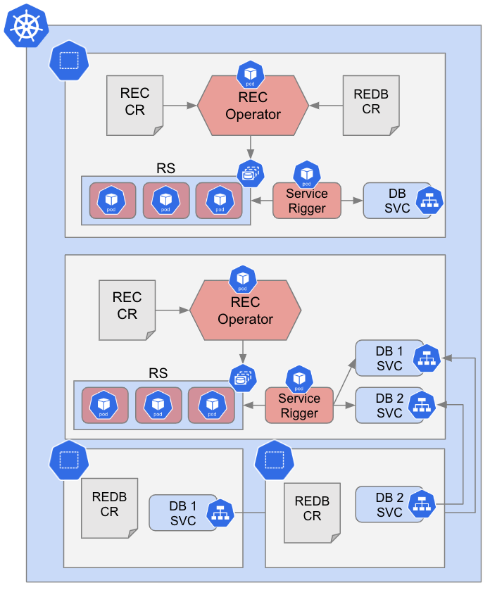
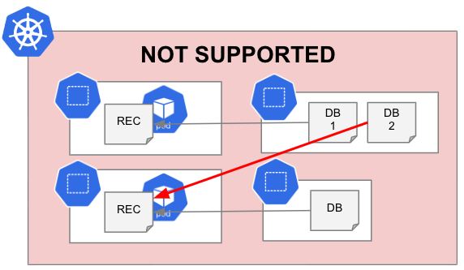
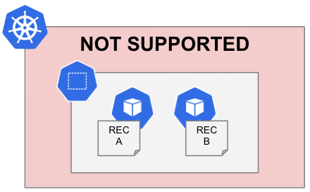

参考 https://docs.redis.com/latest/kubernetes/architecture/

<!-- TOC -->

- [名词解释](#%E5%90%8D%E8%AF%8D%E8%A7%A3%E9%87%8A)
- [分层架构](#%E5%88%86%E5%B1%82%E6%9E%B6%E6%9E%84)
- [基于 Operator 的部署方案](#%E5%9F%BA%E4%BA%8E-operator-%E7%9A%84%E9%83%A8%E7%BD%B2%E6%96%B9%E6%A1%88)
- [一个 Pod 对应多个 Service](#%E4%B8%80%E4%B8%AA-pod-%E5%AF%B9%E5%BA%94%E5%A4%9A%E4%B8%AA-service)
- [灵活的部署方案](#%E7%81%B5%E6%B4%BB%E7%9A%84%E9%83%A8%E7%BD%B2%E6%96%B9%E6%A1%88)
  - [单个 REC 和单个命名空间 one-to-one](#%E5%8D%95%E4%B8%AA-rec-%E5%92%8C%E5%8D%95%E4%B8%AA%E5%91%BD%E5%90%8D%E7%A9%BA%E9%97%B4-one-to-one)
  - [单个 REC 和多个命名空间 one-to-many](#%E5%8D%95%E4%B8%AA-rec-%E5%92%8C%E5%A4%9A%E4%B8%AA%E5%91%BD%E5%90%8D%E7%A9%BA%E9%97%B4-one-to-many)
  - [多个 REC 和多个命名空间 many-to-many](#%E5%A4%9A%E4%B8%AA-rec-%E5%92%8C%E5%A4%9A%E4%B8%AA%E5%91%BD%E5%90%8D%E7%A9%BA%E9%97%B4-many-to-many)
  - [不支持的部署模式](#%E4%B8%8D%E6%94%AF%E6%8C%81%E7%9A%84%E9%83%A8%E7%BD%B2%E6%A8%A1%E5%BC%8F)
    - [跨集群操作](#%E8%B7%A8%E9%9B%86%E7%BE%A4%E6%93%8D%E4%BD%9C)
    - [多个 REC 在一个命名空间内](#%E5%A4%9A%E4%B8%AA-rec-%E5%9C%A8%E4%B8%80%E4%B8%AA%E5%91%BD%E5%90%8D%E7%A9%BA%E9%97%B4%E5%86%85)

<!-- /TOC -->

# 名词解释

- Redis Enterprise node：Redis Enterprise 进程/Pod
- REC (Redis Enterprise Cluster)：由 Redis Enterprise node 组成的集群
- REDB (Redis Enterprise Database)：存储业务数据，由 REC 进行管理，业务处理的 Redis 客户端要连接的就是 REDB

# 分层架构

- K8s：负责 Redis Enterprise node 自愈、伸缩
- REC：故障转移、分片级别的伸缩；集群配置管理、集群监控
- REC over K8s：服务发现；依托 K8s 的资源隔离，可以方便地进行 REC 版本升级

# 基于 Operator 的部署方案

Operator 保证了 Redis 可以在不同的 K8s 发行版上维护一套统一的部署方案，Statefulset 和反亲和性确保每个 Redis Enterprise node 被托管在不同的虚机/物理服务器上。

[What is an operator?](https://docs.redis.com/6.4/kubernetes/architecture/operator/) | [什么是 Operator？](./operator.md)

# 一个 Pod 对应多个 Service

每个 Pod 可以对应多个 Redis Enterprise 实例（多个 Service）。按照之前的做法，在 K8s 上部署一个 Redis Enterprise 数据库，每个 Pod 只会包含一个 Redis Enterprise 实例，同时占用 1 个专门的 CPU，这显然并不高效。Redis Enterprise 异常的快并且大多数情况下可以只使用一小部分 CPU 来传输被请求的吞吐。此外，在多个 Pod 间使用多个 Redis Enterprise 实例运行 1 个 REC 时，使用虚拟交换机的 K8s 网络，可能会迅速地成为应用的瓶颈。因此，Redis 采取一种不同的方法来管理 K8s 环境上的 Redis Enterprise。1 个 Pod 上部署多个 Redis Enterprise 数据库实例，在保持相同的隔离级别时，可以让我们更好地利用被 Pod 使用的硬件资源，例如 CPU、内存、网络。参考下面这张图：

> 在实际的使用上就是，多个 REDB/Service 可以对应到 1 个 Pod 上的不同端口

Redis 6 有一项新特性就是 Cluster Proxy 集群代理，客户端只需要用 standalone 模式连接 `proxy` 反向代理组件，不需要关心后端的 Reis 到底是采用哪种部署架构。

# 灵活的部署方案

> 翻译自 https://docs.redis.com/6.4/kubernetes/deployment/deployment-options/

你可以选择几种不同的方式来部署`Redis Enterprise for Kubernetes`，选择哪种方式取决于你的 REDB 使用需求。

多个 Redis Enterprise Database (REDB) 资源能够被关联到一个 Redis Enterprise Cluster (REC) 资源上，即使这些 REDB 处于不同的命名空间。

> 注意： REC 这种自定义资源必须和 Redis Enterprise operator 处在相同的命名空间。

## 单个 REC 和单个命名空间 (one-to-one)

标准、最简单的部署方案是把 REDB 和 REC 部署在同一命名空间下。无须额外的配置，没有跨命名空间通信的需求。参考[Deploy Redis Enterprise for Kubernetes](https://docs.redis.com/6.4/kubernetes/deployment/quick-start/)。

## 单个 REC 和多个命名空间 (one-to-many)

同一个 Kubernetes 集群上分布在多个命名空间的多个 REDB 可以被关联到同一个 REC 上。参考[Manage databases in multiple namespaces](https://docs.redis.com/latest/kubernetes/re-clusters/multi-namespace/)。

## 多个 REC 和多个命名空间 (many-to-many)

一个 Kubernetes 集群可以包含多个 REC，只需要他们处于不同的命名空间。每个命名空间只能托管一个 REC，并且每个 Operator 只能管理一个 REC。

你可以在单独的命名空间中创建数据库，或者在 REC 所在的命名空间中创建数据库，或者将上述受支持的部署方案组合起来。这种配置适用于多个需要更大隔离性、或不同集群配置的 REC 的使用场景。

参考[Manage databases in multiple namespaces](https://docs.redis.com/latest/kubernetes/re-clusters/multi-namespace/)。

## 不支持的部署模式

### 跨集群操作

`Redis Enterprise for Kubernetes`不支持跨 Kubernetes 集群的操作。REC 只能在一个 K8s 集群中工作。跨集群可能会造成功能和安全性问题。

### 多个 REC 在一个命名空间内

`Redis Enterprise for Kubernetes`不支持同个命名空间多个 REC。在同一个命名空间中创建多个 REC 将会出现错误。

