参考 https://docs.redis.com/6.4/kubernetes/deployment/quick-start/

<!-- TOC -->

- [事前准备](#事前准备)
  - [镜像列表](#镜像列表)
- [私有化部署](#私有化部署)
  - [one-to-one 部署架构](#one-to-one-部署架构)
    - [部署 Operator](#部署-operator)
    - [创建一个 REC](#创建一个-rec)
    - [访问管理页面](#访问管理页面)
    - [（可选）启用 admission controller](#可选启用-admission-controller)
      - [1. 确认 `admission-tls` secret 是否存在](#1-确认-admission-tls-secret-是否存在)
      - [2. 保存证书到环境变量中](#2-保存证书到环境变量中)
      - [3. 创建一个补丁文件](#3-创建一个补丁文件)
      - [4. 给 webhook `redis-enterprise-admission`打补丁](#4-给-webhook-redis-enterprise-admission打补丁)
    - [创建一个 REDB](#创建一个-redb)
  - [one-to-many 部署架构](#one-to-many-部署架构)
    - [为被管理的命名空间创建 Role 和 RoleBinding](#为被管理的命名空间创建-role-和-rolebinding)
    - [更新 Operator ConfigMap](#更新-operator-configmap)
  - [many-to-many 部署架构](#many-to-many-部署架构)
  - [测试代码](#测试代码)
- [Prometheus 监控接入](#prometheus-监控接入)

<!-- /TOC -->

# 事前准备

1. 部署 K8s 集群（至少要有 3 个 K8s node）：

   - k8s >= 1.24：测试时通过`kubeasz`部署
   - nfs provisioner：需要持久化存储，用于保存集群配置文件和日志
   - flannel
   - Prometheus、Grafana

2. 设置一个默认的 StorageClass

   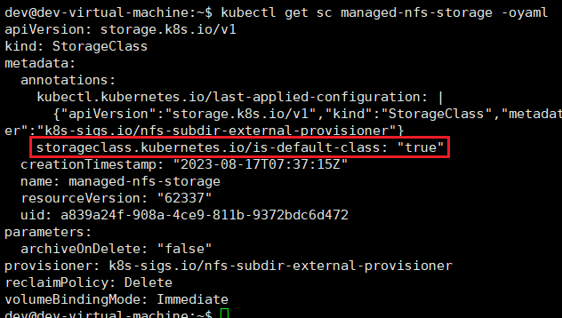

## 镜像列表

- redislabs/operator:6.4.2-8
- redislabs/k8s-controller:6.4.2-8
- redislabs/redis:6.4.2-94

# 私有化部署

> 重要：每个命名空间只可以包含一个 REC。多个不同 Operator 版本的 REC，只要他们在不同的命名空间中，就可以在同一个 K8s 集群上共存。

**创建`redislabs`命名空间，并设置 context 中默认的命名空间为`redislabs`，下面部署的过程中如果没有特别指明，都是在这个 ns 中进行操作**

> 这里推荐使用 kubectl-ns 插件、fzf，可以通过交互模式设置默认的 ns

## one-to-one 部署架构

### 部署 Operator

> 基于 https://raw.githubusercontent.com/RedisLabs/redis-enterprise-k8s-docs/v6.4.2-8/bundle.yaml 修改，修改了镜像拉取策略

```bash
kubectl apply -f ./resources/6.4.2-8_bundle.yaml
```

### 创建一个 REC

REC 集群名字是`wrype-rec-demo`，包含 3 个 node

```bash
kubectl apply -f ./resources/rec-demo.yaml
```

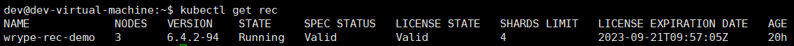

### 访问管理页面

查看 `REC UI` Service 定义的端口，这里的 REC 集群名字是`wrype-rec-demo`

> 默认端口是 8443

```bash
kubectl get service/<cluster-name>-ui
```

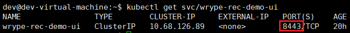

获取登录的账密

```bash
kubectl get secret <cluster-name> -o jsonpath='{.data.username}' | base64 --decode
kubectl get secret <cluster-name> -o jsonpath='{.data.password}' | base64 --decode
```

使用 `kubectl port-forward` 重定向本地端口到 Service 端口

```bash
kubectl port-forward svc/wrype-rec-demo-ui --address 0.0.0.0 8443
```

浏览器打开`https://XXX:8443`并登录后，就可以看到[管理页面](./README.md#管理页面)

### （可选）启用 admission controller

admission controller 可以校验 REDB 资源定义是否合法

#### 1. 确认 `admission-tls` secret 是否存在

```bash
kubectl get secret admission-tls
```

#### 2. 保存证书到环境变量中

```bash
CERT=`kubectl get secret admission-tls -o jsonpath='{.data.cert}'`
```

#### 3. 创建一个补丁文件

将 `<namespace>`替换为 REC 所在的 ns，这里是`redislabs`

> `webhook.yaml` 从 https://github.com/RedisLabs/redis-enterprise-k8s-docs/tree/master/admission 获取

```bash
sed 's/NAMESPACE_OF_SERVICE_ACCOUNT/<namespace>/g' ./resources/webhook.yaml | kubectl create -f -
cat > /tmp/modified-webhook.yaml <<EOF
webhooks:
- name: redisenterprise.admission.redislabs
  clientConfig:
    caBundle: $CERT
  admissionReviewVersions: ["v1beta1"]
EOF
```

#### 4. 给 webhook `redis-enterprise-admission`打补丁

```bash
kubectl patch ValidatingWebhookConfiguration \
  redis-enterprise-admission --patch "$(cat /tmp/modified-webhook.yaml)"
```

确认 admission controller 是否正常工作

```bash
kubectl apply -f - << EOF
apiVersion: app.redislabs.com/v1alpha1
kind: RedisEnterpriseDatabase
metadata:
  name: redis-enterprise-database
spec:
  evictionPolicy: illegal
EOF
```

你应该会看到你的请求被 admission webhook `redisenterprise.admission.redislabs` 拒绝。

```shell
Error from server: error when creating "STDIN": admission webhook "redisenterprise.admission.redislabs" denied the request: eviction_policy: u'illegal' is not one of [u'volatile-lru', u'volatile-ttl', u'volatile-random', u'allkeys-lru', u'allkeys-random', u'noeviction', u'volatile-lfu', u'allkeys-lfu']
```

### 创建一个 REDB

REDB 名字是`redislabs-redb-demo`

```bash
kubectl apply -f ./resources/redislabs-redb-demo.yaml
```

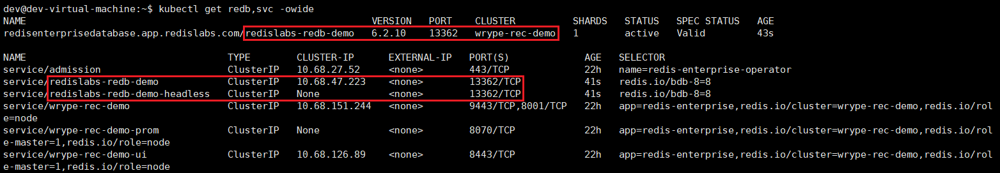

管理页面可以查看并修改 REDB 配置

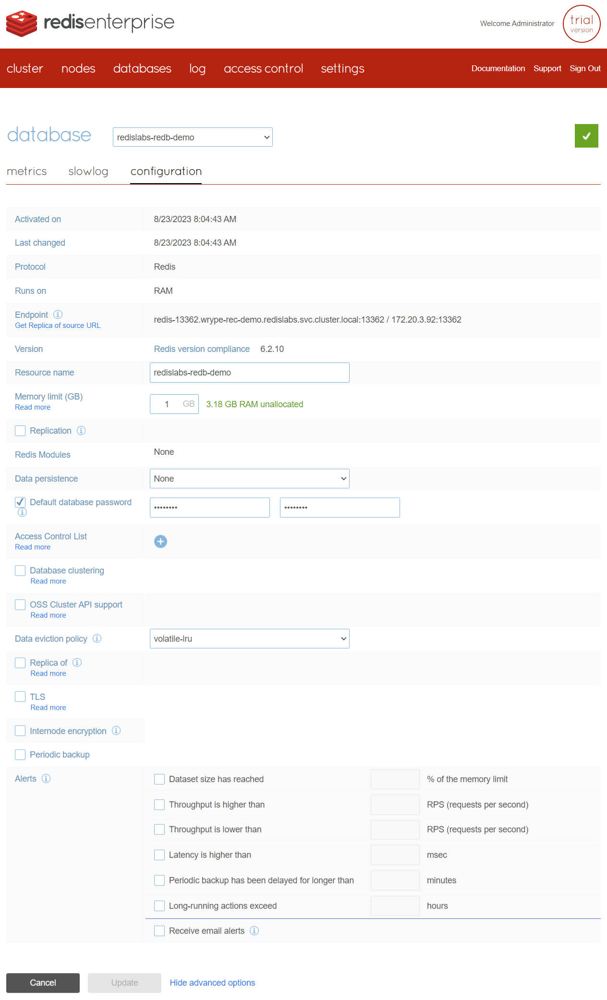

运行测试代码测试 REDB

```bash
# 获取 REDB 密码
echo `kubectl get secret redb-redislabs-redb-demo -o jsonpath="{.data.password}" | base64 --decode`
sed 's/<rdb-addr>/redislabs-redb-demo:13362/g' ./rec-tester/deploy.yaml | sed "s/<rdb-passwd>/rUDnfdVc/g" | kubectl create -f -
```

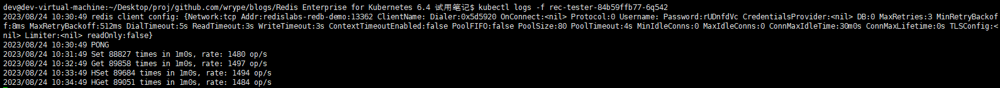

## one-to-many 部署架构

参考 https://docs.redis.com/6.4/kubernetes/re-clusters/multi-namespace/

多个 REDB 资源可以关联到一个 REC 上，即使他们处于不同的命名空间。

了解更多关于怎么设计一个多命名空间的 REC，参考[灵活的部署方案](./arch.md#灵活的部署方案)。

### 为被管理的命名空间创建 Role 和 RoleBinding

为了 Operator 和 REC 能够访问其他命名空间的 REDB，对于每个**被管理**的命名空间，需要创建以下的 role.yaml、role_binding.yaml

> role.yaml 从 https://github.com/RedisLabs/redis-enterprise-k8s-docs/tree/master/multi-namespace-redb 获取

> 将 `<rec-namespace>` 替换为 REC 所在的命名空间，这里是`redislabs`

> 将 `<service-account-name>` 替换为 REC 的名字，这里是`wrype-rec-demo`

> 这里演示**被管理**的命名空间是`bu0`

```bash
kubectl apply -f ./resources/managed-ns-role.yaml -n bu0
```

### 更新 Operator ConfigMap

这里有 2 种方法更新 Operator ConfigMap (operator-environment-config)，指定哪些命名空间被管理。

- 方法 1：配置 Operator watch 命名空间的 label，并添加这个 label 到被管理的命名空间（此特性要求版本>=6.4.2-4）
- 方法 2：在 Operator 配置中显式声明被管理的命名空间列表

你可以在部署前手动创建这个 ConfigMap，或者在 Operator 部署后，由 Operator 自动创建

这里选择方法 2 进行演示

```bash
kubectl patch ConfigMap/operator-environment-config \
--type merge \
-p '{"data":{"REDB_NAMESPACES": "bu0"}}'
```

测试创建 REDB

```bash
kubectl apply -f ./resources/bu-redb-demo.yaml -n bu0
```

这里可以看到 REDB `bu-redb-demo` 被正确并托管到 REC 了

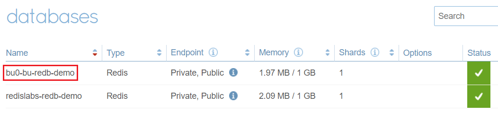

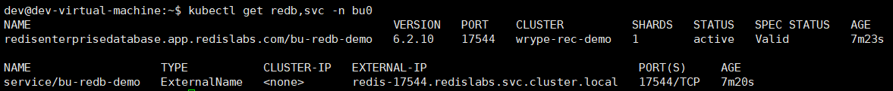

运行测试代码

```bash
# 获取 REDB 密码
echo `kubectl get -n bu0 secret redb-bu-redb-demo -o jsonpath="{.data.password}" | base64 --decode`
sed 's/<rdb-addr>/bu-redb-demo:17544/g' ./rec-tester/deploy.yaml | sed "s/<rdb-passwd>/aZyo736y/g" | kubectl create -n bu0 -f -
```

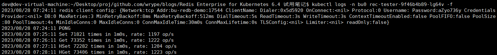

## many-to-many 部署架构

只需要在另一个命名空间部署 Operator 和 REC 即可，这里用命名空间`rec0`做演示

```bash
kubectl apply -f ./resources/6.4.2-8_bundle.yaml -n rec0
sed 's/wrype-rec-demo/rec0-demo/g' ./resources/rec-demo.yaml | kubectl apply -f - -n rec0
```

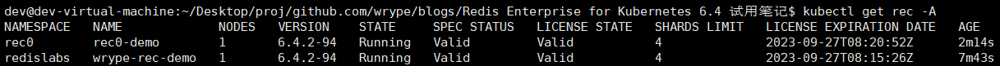

## 测试代码

```bash
cd rec-tester
go build .
docker build --no-cache -t easzlab.io.local:5000/rec-tester:v2 .
docker push easzlab.io.local:5000/rec-tester:v2
```

将[deploy.yaml](./rec-tester/deploy.yaml)中的`REDIS_ADDR`、`REDIS_PASSWD`这 2 项环境变量的值替换为实际的 REDB 地址和密码

# Prometheus 监控接入

参考 https://docs.redis.com/6.4/kubernetes/re-clusters/connect-prometheus-operator/

将 Prometheus 资源 `prometheus-kube-prometheus-prometheus` 中的 `spec.serviceMonitorSelector` 修改为匹配全部

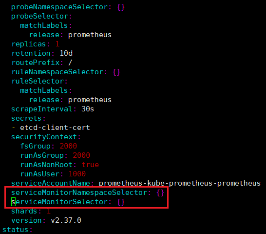

在 REC 所在的命名空间添加 ServiceMonitor

```bash
kubectl apply -f ./resources/servicemonitor.yaml -n redislabs
kubectl apply -f ./resources/servicemonitor.yaml -n rec0
```

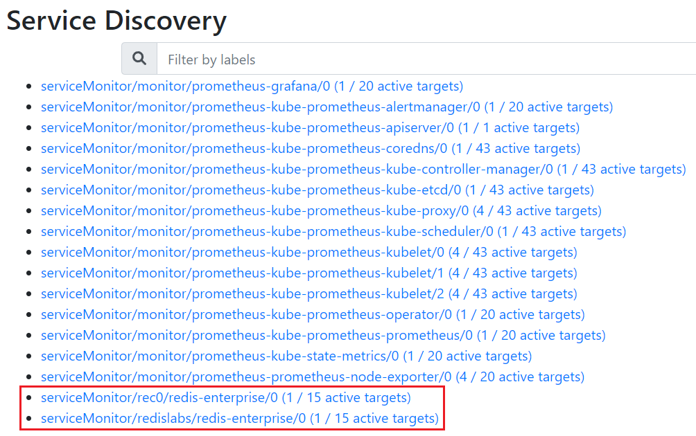

根据[grafana-dashboards-for-redis-enterprise](https://docs.redis.com/6.4/rs/clusters/monitoring/prometheus-integration/#grafana-dashboards-for-redis-enterprise)导入监控面板配置

运行测试代码

```bash
# 获取 REDB 密码
echo `kubectl get -n rec0 secret redb-rec0-redb-demo -o jsonpath="{.data.password}" | base64 --decode`
sed 's/<rdb-addr>/rec0-redb-demo:12963/g' ./rec-tester/deploy.yaml | sed "s/<rdb-passwd>/3tucnKY5/g" | kubectl create -n rec0 -f -
```

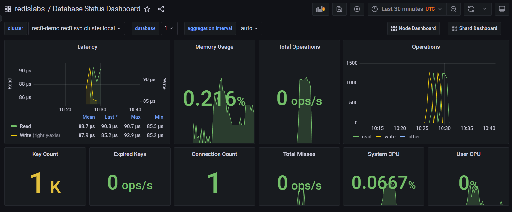
