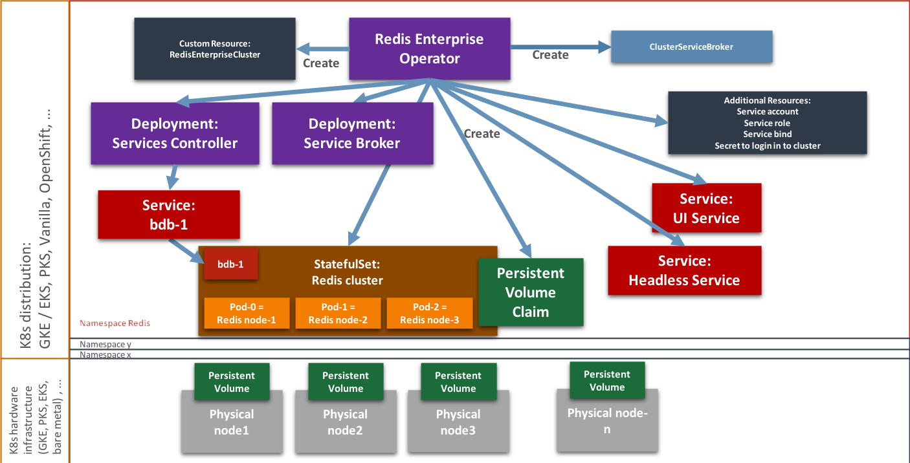

> 翻译自 https://docs.redis.com/6.4/kubernetes/architecture/operator/

Redis Enterprise 是在 Kubernetes 中部署和维护 Redis Enterprise 集群的最快速、高效的方式。

## 什么是 Operator？

Operator 是一种扩展 K8s 原生 API 的 [Kubernetes 自定义控制器](https://kubernetes.io/docs/concepts/extend-kubernetes/api-extension/custom-resources/#custom-controllers)。

Operator 被开发出来用于处理复杂的、有状态的应用，这些应用是默认 K8s 控制器无法处理的。尽管像 [StatefulSet](https://kubernetes.io/docs/concepts/workloads/controllers/statefulset/) 这种现有的 Kubernetes 控制器非常适合部署、维护和伸缩简单无状态应用，但它们不足以处理对有状态资源的访问，也无法处理更复杂、集群化的应用（例如数据库）的升级、调整大小和备份操作。

## Operator 做了什么？

抽象来讲，Operator 将人类操作的知识编码为软件，可以可靠地以可扩展、模块化的方式管理应用，并且不会干扰构成 K8s 架构的基本原语。

Redis 开发了一个 Operator 用于部署和管理一个 Redis Enterprise 集群的生命周期。

Redis Enterprise Operator 充当自定义资源 REC（RedisEnterpriseCluster）的自定义控制器，这种自定义资源通过 K8s CRD（[custom resource definition](https://kubernetes.io/docs/concepts/extend-kubernetes/api-extension/custom-resources/#custom-resources)）来定义并使用 yaml 文件部署。

Operator 的功能包括：

- 校验已部署的集群 REC spec 定义（例如，要求部署奇数个数的 Redis Enterprise node）
- 实现一种对于所有可应用资源进行监控的协调循环
- 事件日志
- 能够对 REC spec 进行简单的编辑

Redis Enterprise Operator 在 K8s 基础设施和 Redis Enterprise Cluster 之间起到一个胶水的作用。

Operator 会创建以下的资源：

- ServiceAccount
- ServiceAccount Role
- ServiceAccount RoleBinding
- Secret – 保存 REC 的用户名、密码、license
- StatefulSet – 维持 Redis Enterprise nodes
- Services Manager Deployment – 暴露 database 并且给 Redis Enterprise node 打标签
- Redis UI Service
- Service：作为 REST API + Sentinel 运行
- Pod Disruption Budget
- 可选: 一个 Deployment 作为 Service Broker，包含多个 Service 和一个 PVC

下面这张图展示了 Redis Enterprise Operator 的顶层架构：

