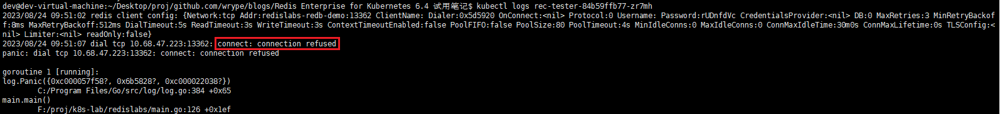
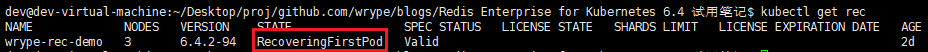
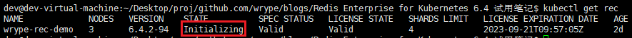
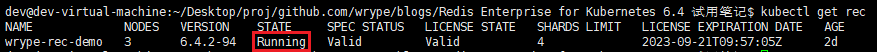
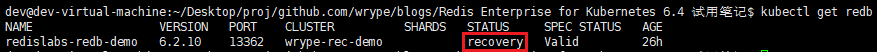
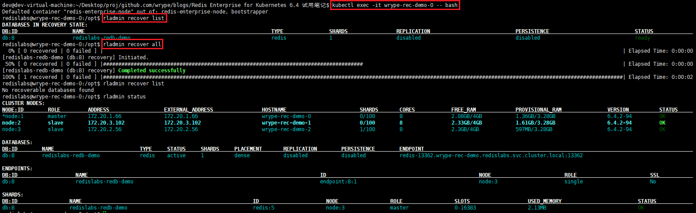
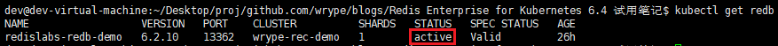
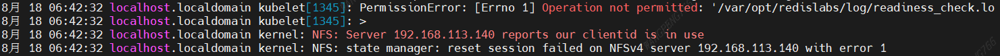

## REC 恢复

参考[Recover a Redis Enterprise cluster on Kubernetes](https://docs.redis.com/latest/kubernetes/re-clusters/cluster-recovery/)

当一个 REC 由于节点故障或者网络分区丢失一半以上节点的联系时（例如重启 K8s 集群），集群将停止响应客户端连接。当发生这种情况时，就必须恢复集群以恢复连接。



```bash
kubectl patch rec <cluster-name> --type merge --patch '{"spec":{"clusterRecovery":true}}'
```

> 这里的集群名字是`wrype-rec-demo`

等待 REC 从`RecoveringFirstPod`切换到`Running`状态

|                                            |
| ------------------------------------------ |
| RecoveringFirstPod                         |
|  |
| Initializing                               |
|  |
| Running                                    |
|  |

开始恢复 REDB，参考[Recover a failed database](https://docs.redis.com/latest/rs/databases/recover/)



```bash
# 进入任意一个 REC 容器
kubectl exec -it wrype-rec-demo-0 -- bash
# 查看可以恢复的 database
rladmin recover list
# 从持久化存储恢复所有的 database
rladmin recover all
# 查看集群状态
rladmin status
```



确认 REDB 处于 active 状态后，恢复完成

> 

## 问题记录

### redb 托管存在部分问题

通过`kubectl`创建的 redb 无法通过管理页面删除，而通过管理页面创建的 redb 无法通过`kubectl get redb`查询到

### nfs clientid is in use 错误

需要为每个 node 设置不同的 hostname，参考 https://linux-nfs.vger.kernel.narkive.com/7VlVmKWg/clientid-is-in-use


