博文地址：https://github.com/wrype/blogs/tree/main/velero%20%E5%AE%9E%E9%AA%8C%E8%AE%B0%E5%BD%95

<!-- TOC -->

- [对象存储 minio 安装](#对象存储-minio-安装)
- [velero 环境准备](#velero-环境准备)
  - [创建 backup-location](#创建-backup-location)
    - [创建 S3 secret](#创建-s3-secret)
    - [创建 bsl](#创建-bsl)
- [备份恢复测试](#备份恢复测试)
  - [修改 coredns 配置，恢复备份](#修改-coredns-配置恢复备份)
  - [定时备份：velero schedule create](#定时备份velero-schedule-create)
  - [文件系统备份](#文件系统备份)
  - [fsfreeze](#fsfreeze)
- [备份数据分析](#备份数据分析)
  - [winmerge](#winmerge)
  - [kopia](#kopia)
    - [备份文件比对](#备份文件比对)
    - [pv 文件恢复](#pv-文件恢复)
- [参考资料](#参考资料)
  - [镜像列表](#镜像列表)
- [附录：restic 试用](#附录restic-试用)
  - [restic 客户端](#restic-客户端)
  - [文件恢复](#文件恢复)

<!-- /TOC -->

# 对象存储 minio 安装

```bash
mkdir -p /data/minio
chmod -R 750 /data/minio
chown -R 1001:1001 /data/minio/
docker run -d --restart=always --name minio \
    --publish 9000:9000 \
    --publish 9001:9001 \
    --env MINIO_ROOT_USER="admin" \
    --env MINIO_ROOT_PASSWORD="admin123" \
    --volume /data/minio:/bitnami/minio/data \
    bitnami/minio:2023.12.23
```

使用管理账号登录 http://192.168.3.18:9001/ ，9001 是控制台端口，9000 是 api 端口

创建账号，账密 velero/velero123

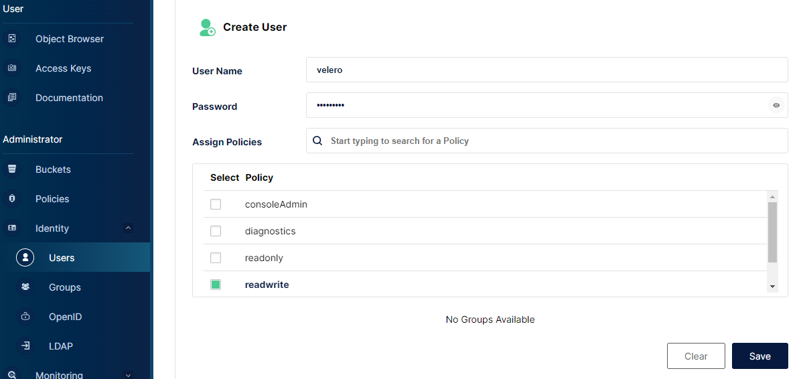

创建 ak（access key） 和 sk（secret key）

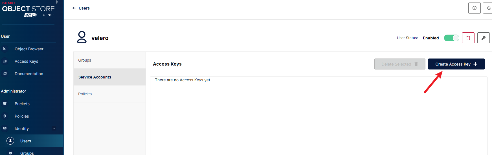

使用 S3 Browser 测试连接

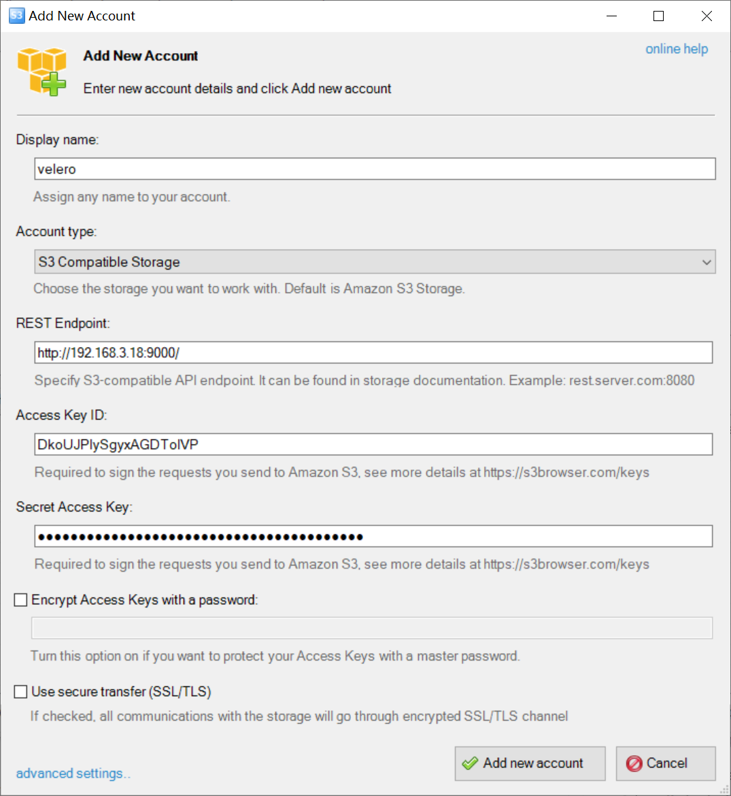

使用 minio 管理页面或者 `S3 Browser` 创建一个桶 `velero` ，默认 region 是 us-east-1

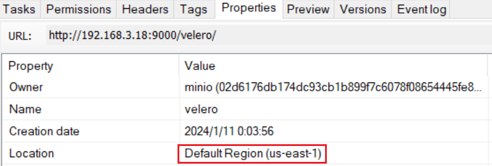

# velero 环境准备

[velero-values.yaml](./velero-values.yaml)

```yaml
image:
  repository: velero/velero
  tag: v1.12.2

initContainers:
  # - name: velero-plugin-for-csi
  #   image: velero/velero-plugin-for-csi:v0.6.0
  #   imagePullPolicy: IfNotPresent
  #   volumeMounts:
  #     - mountPath: /target
  #       name: plugins
  - name: velero-plugin-for-aws
    image: velero/velero-plugin-for-aws:v1.8.0
    imagePullPolicy: IfNotPresent
    volumeMounts:
      - mountPath: /target
        name: plugins

kubectl:
  image:
    repository: docker.io/bitnami/kubectl
    tag: 1.27.1

deployNodeAgent: true

configuration:
  backupStorageLocation: []
  volumeSnapshotLocation: []
  defaultVolumesToFsBackup: false
  uploaderType: kopia

nodeAgent:
  privileged: true
```

| 参数说明                                 |                                                                                 |
| ---------------------------------------- | ------------------------------------------------------------------------------- |
| deployNodeAgent                          | 启用文件系统备份<br>参考 https://velero.io/docs/v1.12/customize-installation/   |
| configuration.backupStorageLocation: []  | 部署时不设置默认 bsl                                                            |
| configuration.volumeSnapshotLocation: [] | 部署时不设置默认 vsl                                                            |
| configuration.uploaderType: kopia        | 将文件系统备份的后端改为 kopia<br>官方测试结果中 kopia 比默认的 restic 性能更好 |

```bash
# helm install --create-namespace -n velero velero -f velero-values.yaml velero-5.2.0.tgz
NAME: velero
LAST DEPLOYED: Fri Dec 29 16:11:32 2023
NAMESPACE: velero
STATUS: deployed
REVISION: 1
TEST SUITE: None
NOTES:
Check that the velero is up and running:

    kubectl get deployment/velero -n velero

Check that the secret has been created:

    kubectl get secret/velero -n velero

Once velero server is up and running you need the client before you can use it
1. wget https://github.com/vmware-tanzu/velero/releases/download/v1.12.2/velero-v1.12.2-darwin-amd64.tar.gz
2. tar -xvf velero-v1.12.2-darwin-amd64.tar.gz -C velero-client

More info on the official site: https://velero.io/docs
```

下载客户端 https://github.com/vmware-tanzu/velero/releases （需要本地能执行 kubectl 命令），`velero version` 测试能否连上服务器

## 创建 backup-location

参考 https://velero.io/docs/v1.12/locations/

### 创建 S3 secret

```
cat << EOF > s3-creds.ini
[default]
aws_access_key_id=DkoUJPIySgyxAGDToIVP
aws_secret_access_key=F7ovCJZQkLSmqBhL8SlWondG9B12bIyCzbZxbwVH
EOF
```

```bash
kubectl create secret generic -n velero s3-creds --from-file=creds=s3-creds.ini
```

### 创建 bsl

> 参考 https://github.com/vmware-tanzu/velero-plugin-for-aws/blob/main/backupstoragelocation.md

```bash
velero backup-location create -n velero bsl-minio \
  --provider aws \
  --bucket velero \
  --config region=us-east-1,s3ForcePathStyle=true,s3Url=http://192.168.3.18:9000/ \
  --credential=s3-creds=creds \
  --default
```

| 参数讲解         |                                                                                          |
| ---------------- | ---------------------------------------------------------------------------------------- |
| s3ForcePathStyle | 强制使用路径模式访问 S3 的桶<br>默认使用虚拟主机模式，这种需要搭配 S3 DNS 服务器一起使用 |

没有任何错误的话会显示 `Available` 状态

```bash
# velero backup-location get bsl-minio
NAME        PROVIDER   BUCKET/PREFIX   PHASE       LAST VALIDATED                  ACCESS MODE   DEFAULT
bsl-minio   aws        velero          Available   2024-01-02 10:23:27 +0800 CST   ReadWrite     true
```

# 备份恢复测试

这里使用 velero 客户端的 example 创建一个 deployment

```bash
kubectl apply -f examples/nginx-app/base.yaml
```

创建一个备份

```bash
velero backup create backup1
```

删除刚刚的 example 后，恢复备份

```bash
kubectl delete -f examples/nginx-app/base.yaml
velero restore create --from-backup backup1
```

## 修改 coredns 配置，恢复备份

```bash
kubectl edit cm -n kube-system coredns
velero restore create --from-backup backup1 --existing-resource-policy update
```

## 定时备份：velero schedule create

## 文件系统备份

helm 安装 velero 时可以设置默认对存储卷启用文件系统备份

```yaml
configuration:
  defaultVolumesToFsBackup: true
```

实际使用时，推荐使用添加注解的方式单独配置需要备份的存储卷，同时按需要添加 fsfreeze 的 sidecar：

```bash
kubectl -n nginx-example annotate pod/nginx-deployment-5df669cf7c-64lz7 backup.velero.io/backup-volumes=nginx-logs
```

## fsfreeze

为了避免潜在的一致性问题，在进行文件系统备份时，建议开启 `fsfreeze` 特性，冻结文件系统，禁止写入

> **警告：`fsfreeze` 会将整个文件系统冻结，如果挂载目录所在的盘是共用的，将会影响其他的业务，甚至导致系统异常**

> **`fsfreeze` 只适用于 Pod 挂载块存储的场景，另外 nfs 并不支持 `fsfreeze`**

修改 example，添加注解 `backup.velero.io/backup-volumes: nginx-logs` 并做一些调整

```yaml
---
apiVersion: v1
kind: Namespace
metadata:
  name: nginx-example2
  labels:
    app: nginx
---
kind: PersistentVolumeClaim
apiVersion: v1
metadata:
  name: nginx-logs
  namespace: nginx-example2
  labels:
    app: nginx
spec:
  storageClassName: local
  accessModes:
    - ReadWriteOnce
  resources:
    requests:
      storage: 50Mi
---
apiVersion: apps/v1
kind: Deployment
metadata:
  name: nginx-deployment
  namespace: nginx-example2
spec:
  replicas: 1
  selector:
    matchLabels:
      app: nginx
  template:
    metadata:
      labels:
        app: nginx
      annotations:
        pre.hook.backup.velero.io/container: fsfreeze
        pre.hook.backup.velero.io/command: '["/sbin/fsfreeze", "--freeze", "/var/log/nginx"]'
        post.hook.backup.velero.io/container: fsfreeze
        post.hook.backup.velero.io/command: '["/sbin/fsfreeze", "--unfreeze", "/var/log/nginx"]'
        backup.velero.io/backup-volumes: nginx-logs
    spec:
      volumes:
        - name: nginx-logs
          persistentVolumeClaim:
            claimName: nginx-logs
      containers:
        - image: nginx:1.17.6
          name: nginx
          ports:
            - containerPort: 80
          volumeMounts:
            - mountPath: "/var/log/nginx"
              name: nginx-logs
              readOnly: false
        - image: ubuntu:bionic
          name: fsfreeze
          securityContext:
            privileged: true
          volumeMounts:
            - mountPath: "/var/log/nginx"
              name: nginx-logs
              readOnly: false
          command:
            - "/bin/bash"
            - "-c"
            - "sleep infinity"
---
apiVersion: v1
kind: Service
metadata:
  labels:
    app: nginx
  name: my-nginx
  namespace: nginx-example2
spec:
  ports:
    - port: 80
      targetPort: 80
  selector:
    app: nginx
  type: LoadBalancer
```

创建 local pv

```yaml
apiVersion: v1
kind: PersistentVolume
metadata:
  name: example-pv
spec:
  capacity:
    storage: 5Gi
  volumeMode: Filesystem
  accessModes:
    - ReadWriteOnce
  persistentVolumeReclaimPolicy: Delete
  storageClassName: local
  mountOptions:
    - noatime
  local:
    path: /var/localdata
  nodeAffinity:
    required:
      nodeSelectorTerms:
        - matchExpressions:
            - key: kubernetes.io/hostname
              operator: In
              values:
                - core-node-02
```

```bash
velero backup create backup2
```

文件系统备份时会为每个命名空间都会建立独立的 FSB 仓库

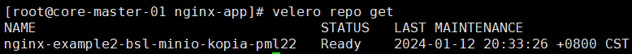

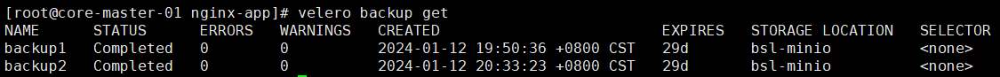

# 备份数据分析

## winmerge

可以通过 S3 browser 将备份下载到本地，然后通过 winmerge 进行比对，检查前后的变化

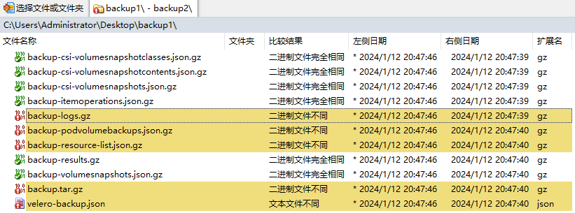

双击压缩包可以直接进行比对

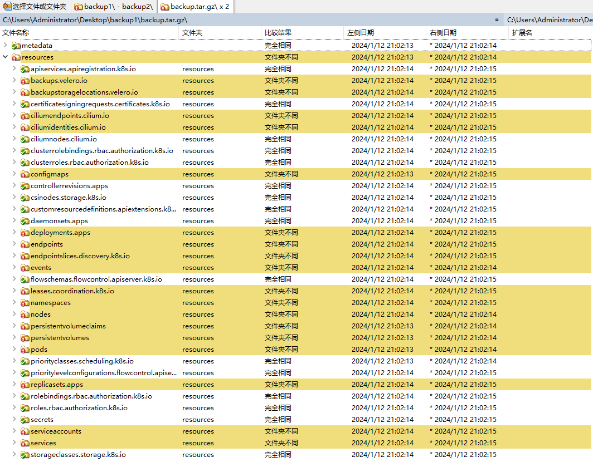

使用插件格式化 json 并比对

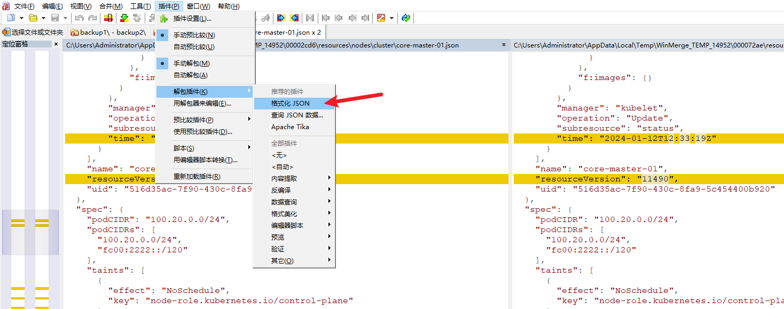

## kopia

对称加密的密码来自 velero-repo-credentials base64 解码

```bash
kopia repository connect s3 --bucket=velero --access-key=DkoUJPIySgyxAGDToIVP --secret-access-key=F7ovCJZQkLSmqBhL8SlWondG9B12bIyCzbZxbwVH -p static-passw0rd --endpoint 192.168.3.18:9000 --prefix kopia/nginx-example2/ --region us-east-1 --disable-tls
```

### 备份文件比对

`kopia snapshot list --all`

```bash
default@default:/host_pods/c6ac8c50-a958-4cb2-b193-a184d652078f/volumes/kubernetes.io~nfs/pvc-70b7e3e1-39fe-46c1-a781-7a4af92100a2
  2024-01-04 23:24:29 CST kb6c4e2e457d7ee287935a68e7d39548b 395 B drwxrwxrwx files:2 dirs:1 (latest-2) pins:velero-pin
  2024-01-04 23:59:30 CST kbf13dc2d0537b26308654d973886b9a8 1.6 KB drwxrwxrwx files:2 dirs:1 (latest-1,hourly-1,daily-1,monthly-1,annual-1) pins:velero-pin
```

`kopia diff -f kb6c4e2e457d7ee287935a68e7d39548b kbf13dc2d0537b26308654d973886b9a8`

```diff
./access.log sizes differ:  188 576
./access.log modification times differ:  2024-01-04 23:23:11.128304442 +0800 CST 2024-01-04 23:59:09.205492833 +0800 CST
changed ./access.log at 2024-01-04 23:59:09.205492833 +0800 CST (size 188 -> 576)
--- old/access.log	2024-01-05 00:16:04.290796064 +0800
+++ new/access.log	2024-01-05 00:16:04.290796064 +0800
@@ -1,2 +1,6 @@
100.20.4.41 - - [04/Jan/2024:15:23:00 +0000] "GET / HTTP/1.1" 200 612 "-" "curl/8.0.1" "-"
100.20.4.41 - - [04/Jan/2024:15:23:06 +0000] "GET /tester HTTP/1.1" 404 153 "-" "curl/8.0.1" "-"
+100.20.4.41 - - [04/Jan/2024:15:58:58 +0000] "GET /tester HTTP/1.1" 404 153 "-" "curl/8.0.1" "-"
+100.20.4.41 - - [04/Jan/2024:15:59:00 +0000] "GET /tester HTTP/1.1" 404 153 "-" "curl/8.0.1" "-"
+100.20.4.41 - - [04/Jan/2024:15:59:02 +0000] "GET /tester HTTP/1.1" 404 153 "-" "curl/8.0.1" "-"
+100.20.4.41 - - [04/Jan/2024:15:59:04 +0000] "GET /tester HTTP/1.1" 404 153 "-" "curl/8.0.1" "-"
./error.log sizes differ:  207 1035
./error.log modification times differ:  2024-01-04 23:23:11.128304442 +0800 CST 2024-01-04 23:59:09.205492833 +0800 CST
changed ./error.log at 2024-01-04 23:59:09.205492833 +0800 CST (size 207 -> 1035)
--- old/error.log	2024-01-05 00:16:04.292796115 +0800
+++ new/error.log	2024-01-05 00:16:04.292796115 +0800
@@ -1 +1,5 @@
2024/01/04 15:23:06 [error] 7#7: *2 open() "/usr/share/nginx/html/tester" failed (2: No such file or directory), client: 100.20.4.41, server: localhost, request: "GET /tester HTTP/1.1", host: "100.68.78.66"
+2024/01/04 15:58:58 [error] 7#7: *3 open() "/usr/share/nginx/html/tester" failed (2: No such file or directory), client: 100.20.4.41, server: localhost, request: "GET /tester HTTP/1.1", host: "100.68.78.66"
+2024/01/04 15:59:00 [error] 7#7: *4 open() "/usr/share/nginx/html/tester" failed (2: No such file or directory), client: 100.20.4.41, server: localhost, request: "GET /tester HTTP/1.1", host: "100.68.78.66"
+2024/01/04 15:59:02 [error] 7#7: *5 open() "/usr/share/nginx/html/tester" failed (2: No such file or directory), client: 100.20.4.41, server: localhost, request: "GET /tester HTTP/1.1", host: "100.68.78.66"
+2024/01/04 15:59:04 [error] 7#7: *6 open() "/usr/share/nginx/html/tester" failed (2: No such file or directory), client: 100.20.4.41, server: localhost, request: "GET /tester HTTP/1.1", host: "100.68.78.66"
```

### pv 文件恢复

velero 无法在已存在的 pv 上恢复数据，需要将工作负载删除后，再使用 velero restore 恢复。

或者将工作负载的副本数调为 0，node 上进入 pod 的挂载目录，使用 `kopia restore <snapshot ID> .` 恢复。

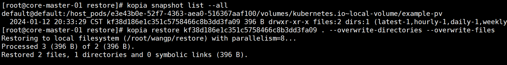

# 参考资料

- 文件系统备份 FSB：https://velero.io/docs/v1.12/customize-installation/
- kopia vs restic 官方测试结果：https://velero.io/docs/v1.10/performance-guidance/

## 镜像列表

- docker.io/bitnami/kubectl:1.27.1
- docker.io/velero/velero:v1.12.2
- docker.io/velero/velero-plugin-for-aws:v1.8.0
- 提供 fsfreeze 工具：docker.io/library/ubuntu:bionic

# 附录：restic 试用

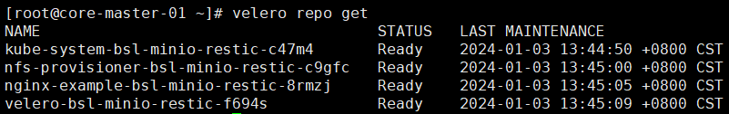

## restic 客户端

> 参考 https://restic.readthedocs.io/en/latest/080_examples.html#initializing-the-restic-repository

> 参考 https://restic.readthedocs.io/en/latest/040_backup.html#environment-variables

RESTIC_PASSWORD 来自 velero-repo-credentials base64 解码

```bash
export AWS_DEFAULT_REGION="us-east-1"
export AWS_ACCESS_KEY_ID="DkoUJPIySgyxAGDToIVP"
export AWS_SECRET_ACCESS_KEY="F7ovCJZQkLSmqBhL8SlWondG9B12bIyCzbZxbwVH"
export RESTIC_PASSWORD="static-passw0rd"
export RESTIC_REPOSITORY="s3:http://192.168.3.18:9000/velero/restic/nginx-example"
restic snapshots --compact
```

## 文件恢复

将工作负载的副本数调为 0，node 上进入 pod 的挂载目录，使用 `restic restore <snapshot ID> --target .` 恢复
