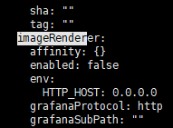
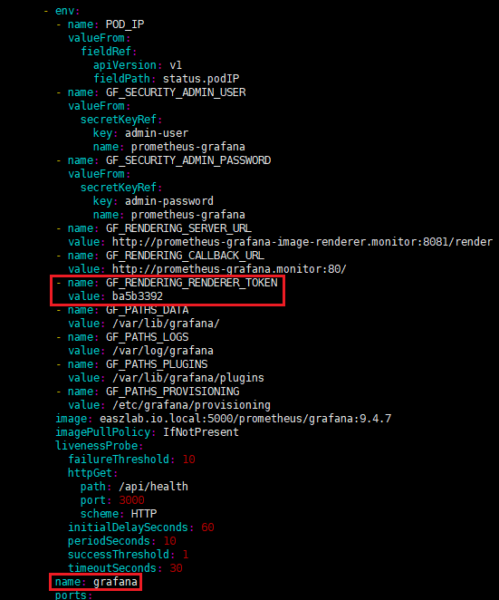

博文地址：[配置 Grafana Image Renderer 用于图片导出](https://github.com/wrype/blogs/tree/main/%E9%85%8D%E7%BD%AE%20Grafana%20Image%20Renderer%20%E7%94%A8%E4%BA%8E%E5%9B%BE%E7%89%87%E5%AF%BC%E5%87%BA)

<!-- TOC -->

- [问题描述](#%E9%97%AE%E9%A2%98%E6%8F%8F%E8%BF%B0)
- [Grafana Image Renderer 效果演示](#grafana-image-renderer-%E6%95%88%E6%9E%9C%E6%BC%94%E7%A4%BA)
  - [默认图片渲染](#%E9%BB%98%E8%AE%A4%E5%9B%BE%E7%89%87%E6%B8%B2%E6%9F%93)
  - [通过 url 参数调整渲染图片大小](#%E9%80%9A%E8%BF%87-url-%E5%8F%82%E6%95%B0%E8%B0%83%E6%95%B4%E6%B8%B2%E6%9F%93%E5%9B%BE%E7%89%87%E5%A4%A7%E5%B0%8F)
  - [通过 Restful 接口调用获取图片，用于报表生成](#%E9%80%9A%E8%BF%87-restful-%E6%8E%A5%E5%8F%A3%E8%B0%83%E7%94%A8%E8%8E%B7%E5%8F%96%E5%9B%BE%E7%89%87%E7%94%A8%E4%BA%8E%E6%8A%A5%E8%A1%A8%E7%94%9F%E6%88%90)
- [helm chart 启用 imageRenderer](#helm-chart-%E5%90%AF%E7%94%A8-imagerenderer)
  - [（可选）启用入站网络策略](#%E5%8F%AF%E9%80%89%E5%90%AF%E7%94%A8%E5%85%A5%E7%AB%99%E7%BD%91%E7%BB%9C%E7%AD%96%E7%95%A5)
- [（可选）配置 token 验证](#%E5%8F%AF%E9%80%89%E9%85%8D%E7%BD%AE-token-%E9%AA%8C%E8%AF%81)
  - [helm 配置 renderer_token](#helm-%E9%85%8D%E7%BD%AE-renderer_token)
  - [调试过程](#%E8%B0%83%E8%AF%95%E8%BF%87%E7%A8%8B)
- [参考&说明](#%E5%8F%82%E8%80%83%E8%AF%B4%E6%98%8E)

<!-- /TOC -->

# 问题描述

Grafana 页面上存在一个图片导出的按钮，如果没有配置 `Grafana Image Renderer` 插件，则会导出失败


|                                            | 没有安装插件时有时会提示需要安装插件       |
| ------------------------------------------ | ------------------------------------------ |
|  |  |
|  |                                            |

# Grafana Image Renderer 效果演示

## 默认图片渲染


## 通过 url 参数调整渲染图片大小


## 通过 Restful 接口调用获取图片，用于报表生成


# helm chart 启用 imageRenderer

如果是使用官方的 helm chart 部署 Grafana，我们只需要简单的启用 `imageRenderer`，就可以完成 `Grafana Image Renderer` 的部署

先查看已部署的 chart 中是否定义了 imageRenderer

```bash
helm -n monitor get values prometheus -a |less
```



这里可以看到 chart 中定义了 imageRenderer，我们直接启用就行

values 文件：[grafana-overrides.yaml](./grafana-overrides.yaml)

```yaml
grafana:
  # 定义面板展示的时区
  defaultDashboardsTimezone: Asia/Shanghai
  imageRenderer:
    enabled: true
    image:
      pullPolicy: IfNotPresent
      repository: grafana/grafana-image-renderer
      tag: 3.5.0
    networkPolicy:
      limitIngress: false
```

| 字段说明                                         |                                                                |
| ------------------------------------------------ | -------------------------------------------------------------- |
| grafana.imageRenderer.image.tag                  | grafana-image-renderer > 3.5.0 需要配置 token<br>默认是 latest |
| grafana.imageRenderer.networkPolicy.limitIngress | 是否启用入站网络策略<br>默认是启用                             |

> 参考 https://grafana.com/docs/grafana/latest/setup-grafana/image-rendering/#security ，以下版本默认会启用 token
> 

更新 RELEASE prometheus

```bash
helm -n monitor upgrade --reuse-values prometheus ./kube-prometheus-stack-39.11.0.tgz -f ./grafana-overrides.yaml
```

| 参数说明                            |                                                                                |
| ----------------------------------- | ------------------------------------------------------------------------------ |
| -n monitor                          | Prometheus 部署的命名空间                                                      |
| **--reuse-values**                  | 基于现有的 values 进行更新，不指定这个参数的话之前部署配置的 values 会被覆盖掉 |
| prometheus                          | helm 部署的 `RELEASE` 名字                                                     |
| ./kube-prometheus-stack-39.11.0.tgz | chart 文件<br>这里测试环境使用 `kubeasz-3.3.5` 部署                            |

> 注意这里的更新操作会重启 Grafana

| 更新后可以看到多了一个 Deployment，Grafana 也多了 2 个环境变量 |                                            |
| -------------------------------------------------------------- | ------------------------------------------ |
|                      |  |

| 现在页面上可以直接生成图片了               |                                            |
| ------------------------------------------ | ------------------------------------------ |
|  |  |

## （可选）启用入站网络策略

> 启用入站网络策略后，只有 Grafana Pod 可以访问 image-renderer

将 [grafana-overrides.yaml](./grafana-overrides.yaml) 的 `grafana.imageRenderer.networkPolicy.limitIngress` 设置为 `true`

```bash
kubectl -n monitor edit networkpolicy prometheus-grafana-image-renderer-ingress
```

| chart kube-prometheus-stack-39.11.0 的 NetworkPolicy 存在问题，upgrade 后需要再修改一下 |                                            |
| --------------------------------------------------------------------------------------- | ------------------------------------------ |
|                                               |  |

| 测试 NetworkPolicy 是否生效                |                                            |
| ------------------------------------------ | ------------------------------------------ |
|  |  |

# （可选）配置 token 验证

> 使用 `kubeasz-master` 进行部署测试，Grafana 版本 9.4.7，需要注意版本兼容性

## helm 配置 renderer_token

values 文件：[grafana-overrides-token.yaml](./grafana-overrides-token.yaml)

```yaml
grafana:
  # 定义面板展示的时区
  defaultDashboardsTimezone: Asia/Shanghai
  imageRenderer:
    enabled: true
    image:
      pullPolicy: IfNotPresent
      repository: grafana/grafana-image-renderer
      tag: 3.7.2
    networkPolicy:
      limitIngress: false
    env:
      AUTH_TOKEN: ba5b3392
  envRenderSecret:
    GF_RENDERING_RENDERER_TOKEN: ba5b3392
```

```bash
helm -n monitor upgrade --reuse-values prometheus ./kube-prometheus-stack-45.23.0 -f ./grafana-overrides-token.yaml
```

## 调试过程

values 文件：[grafana-overrides-token.yaml](./grafana-overrides-token.yaml)

```yaml
grafana:
  # 定义面板展示的时区
  defaultDashboardsTimezone: Asia/Shanghai
  imageRenderer:
    enabled: true
    image:
      pullPolicy: IfNotPresent
      repository: grafana/grafana-image-renderer
      tag: 3.7.2
    networkPolicy:
      limitIngress: false
```

```bash
helm -n monitor upgrade --reuse-values prometheus ./kube-prometheus-stack-45.23.0 -f ./grafana-overrides-token.yaml
```

upgrade 后测试可以导出图片，修改 grafana-image-renderer 的默认 token `AUTH_TOKEN`，重启 Pod

> grafana 和 grafana-image-renderer 的默认 token 是 `"-"`，对安全要求不高的话可以不用修改配置

```bash
kubectl edit -n monitor deploy prometheus-grafana-image-renderer
```

|                                            | 现在 token 错误，渲染图片失败              |
| ------------------------------------------ | ------------------------------------------ |
|  |  |

grafana 修改环境变量 `GF_RENDERING_RENDERER_TOKEN`，重启 Pod

> grafana-server 会根据 grafana.ini 读取环境变量，参考代码 [applyEnvVariableOverrides](https://github.com/grafana/grafana/blob/9c83dd43d97b283c98abd70121b4b41398599b9d/pkg/setting/setting.go#L672C15-L672C15)

```bash
kubectl edit -n monitor deploy prometheus-grafana
```

|                                            | 现在图片可以渲染出来了                     |
| ------------------------------------------ | ------------------------------------------ |
|  |  |

# 参考&说明

官方建议最少预留 16GB 的内存给 `Grafana Image Renderer`，这个插件的工作原理是跑一个没有 GUI 的 Chromium 浏览器来渲染图片

- 插件介绍：https://grafana.com/grafana/plugins/grafana-image-renderer/
- [Set up image rendering](https://grafana.com/docs/grafana/latest/setup-grafana/image-rendering/)
